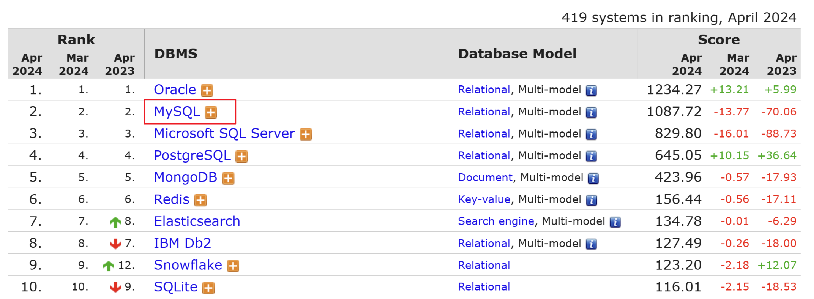
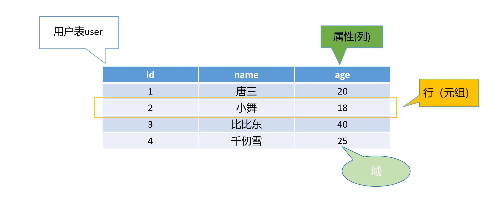
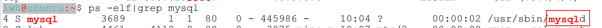
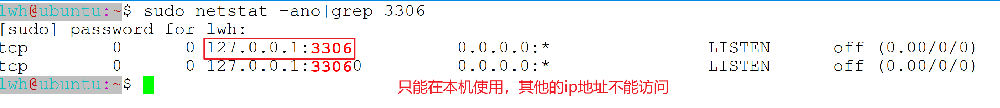
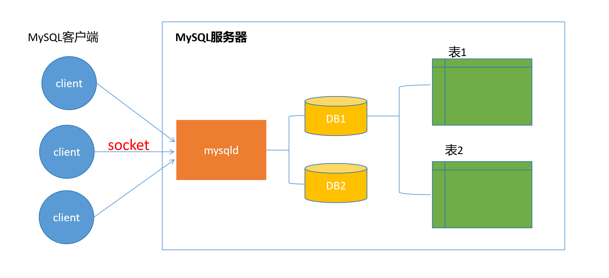
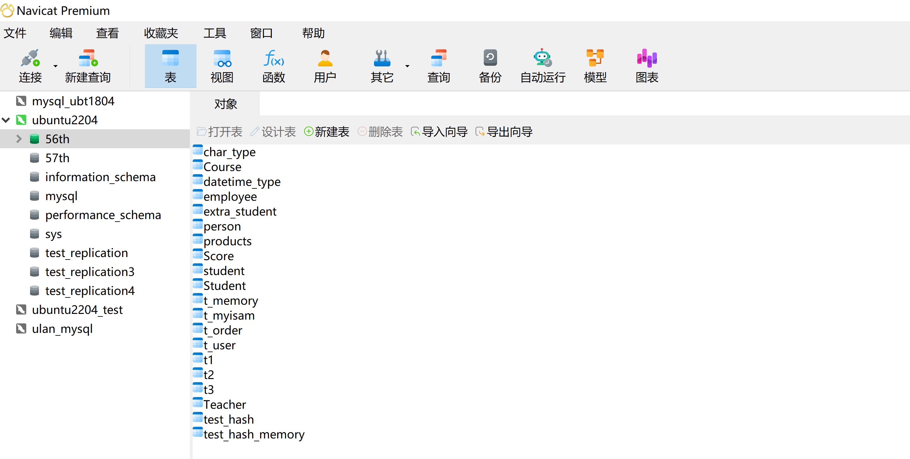

###### <font color = orange>MySQL教程</font><br/>——<br />MySQL基础部分<sup>卷1</sup><br/>`已最新版本|V1.0`<br/>**星空**<br/>*COPYRIGHT ⓒ 2024-2026. 王道版权所有*

[TOC]

# 数据库简介

> ~(Gn!)~
>
> 在实际的开发过程中，应用程序会有大量的数据需要持久地存储在磁盘之中，目前我们已知的持久化存储的方式就是采用文件，但是在磁盘物理的结构上，文件其实是一种顺序的字符集合。使用文件可以很方便地输入和输出数据，但是这些数据都是简单的字节流，不包含任何复杂数据结构，所以应用开发者需要花费大量的时间去解析文件的内容，并将其映射到内存的数据结构以供应用程序后续使用。除此之外，由于磁盘的顺序读写的速度要远远快于随机读写，所以为了访问位置靠后的数据，要消耗大量的时间（类似于链表的访问）。另外，文件系统的数据无法保证数据的安全性，应用程序没有办法在存储数据的时候检查其是否正确，而当部分数据损坏时，文件系统本身无法定位问题和设计修复方案。
>
> 数据库是“按照数据结构来组织、存储和管理数据的仓库”。它是一个长期存储在计算机内的、有组织的、可共享的、统一管理的大量数据的集合。数据库具有以下特点：
>
> - 数据结构化：数据库系统实现了整体数据的结构化，数据之间具有联系。
> - 数据的共享性高，冗余度低，易扩充：数据是面向整体的，可以被多个用户、多个应用程序共享使用，大大减少了数据冗余，节约了存储空间。
> - 数据独立性高：数据独立性包括数据的物理独立性和逻辑独立性。物理独立性是指数据在磁盘上的存储方式由数据库管理系统（DBMS）管理，用户程序不需要了解；逻辑独立性是指用户的应用程序与数据库的逻辑结构是相互独立的，当数据的逻辑结构改变时，用户程序可以不需要改变。
> - 数据由DBMS统一管理和控制：DBMS必须提供数据的安全性保护、完整性检查、并发访问控制和故障恢复等功能。
>
## 数据库分类
> ~(Gn!)~
>
> 数据库可以根据不同的分类标准划分为多种类型。当前的数据库可以大致分为两类：关系型数据库和非关系型数据库。
>
> - 关系型数据库使用**关系**来组织数据库当中的各个数据，所谓的关系可以认为就是有若干行和列构成的表格。由于关系型数据库便于理解易于使用，所以长期以来是市场上的主流数据库模式。关系型数据库通常会采用一个名为SQL（Structured Query Language，结构化查询语言）的语言来访问和更新。现在市场占用率比较高的关系型数据库有这些：Oracle、MySQL、PostgreSQL、DB2、Informix、Sybase、SQL Server 2000、Access、SQLite。Oracle是商业数据库，性能优异但是收费昂贵，一般用于传统行业和银行领域；MySQL和PostgreSQL是开源的关系型数据库管理系统，被大多数互联网公司采用。
>
> - 非关系型数据库现在一般统称为NoSQL，由于在市场竞争中始终无法取代关系型数据库，现在一般将其解释为"Not only SQL"，从而表示非关系型数据库是关系型数据的补充之义。NoSQL一般认为不适合作为通用领域的存储部件，但是在一些特定领域，比如高并发领域等等还是有一定的用武之地。常见的NoSQL产品有：Redis、Memcached、MongoDB、Cassandra等等。NoSQL的存储结构各有千秋，不过一般都会支持key-value的键值对存储结构。
>
> 我们课程中使用的是目前数据库排行榜上排名第二的关系型数据库MySQL.
>
> 
>
> 数据库排行榜的链接是： https://db-engines.com/en/ranking，大家可以自行查看。
> 

## 关系模型
> ~(Gn!)~
>
> **关系模型**
>
> 在关系模型中，关系、元组、属性和域是核心概念，以下是它们各自的定义和相互之间的关系：
>
> **关系（Relation）**：
>关系在数据库中表示为一个二维表，这个二维表由行和列组成。它实际上描述了数据之间的一种逻辑结构或联系。一个关系就是一个数据表，包含了多个元组（记录）和多个属性（字段）。
> 
>**元组（Tuple）**：
> 在关系模型中，元组是关系（表）中的一行，代表了一个具体的实体或记录。元组是关系中的单个实例，由多个属性值组成。在二维表中，每一行就是一个元组。
>
> **属性（Attribute）**：
> 属性是关系（表）中的一列，代表了实体的某个特征或属性。每个属性都有一个特定的名称和数据类型，用于描述实体的某个方面。在二维表中，每一列就是一个属性。
>
> **域（Domain）**：
> 域是属性的取值范围，即属性可以取到的值的集合。它定义了属性的数据类型和可能的取值范围。例如，一个表示年龄的属性的域可能是0到150之间的整数。
>
> 关系、元组、属性和域之间的关系可以用以下方式描述：
> 
>- 关系是由多个元组组成的，每个元组都是关系中的一个实例。
> 
> - 每个元组由多个属性值组成，这些属性值对应于关系中的各个属性。
>
> - 每个属性都有一个特定的域，定义了该属性可以取到的值的范围。
>
> 简单来说，关系描述了一个数据表的结构，元组是表中的具体记录，属性是表中的列（即数据的特征），而域则定义了属性的取值范围。这四个概念共同构成了关系模型的基础。
>
> 
>
> 


## MySQL发展历史

> ~(Gn!)~
>
> MySQL 是一款开源的关系型数据库管理系统 (RDBMS)，其历史可以追溯到1994年。当时，两位瑞典工程师 Michael Widenius 和 David Axmark 在瑞典乌普萨拉大学的计算机科学系工作，他们开始着手于一个轻量级的数据库项目，命名为 mSQL(miniSQL)。
>
> 在经过几年的发展和改善后，Widenius 和 Axmark 开始寻求将他们的项目扩展为更为完整的数据库系统。1995 年，MySQL 1.0版正式发布，MySQL 取代了 mSQL 成为这个新项目的名称。MySQL 的目标是成为一个功能强大的数据库管理系统，能够处理大规模数据集，并支持多种应用程序。（MySQL这个名字据说是Widenius根据自己女儿的名字来命名的。）
>
> MySQL 最初的版本只包含一些基本的功能，例如查询语言和表结构定义，但随着时间的推移，MySQL 逐渐成熟，并逐步扩展了许多实用和复杂的功能。其中，最令人印象深刻的改变之一是增加了支持存储过程和触发器的功能。
>
> 自 MySQL 首次发布以来，就一直是一款免费开源的数据库软件，用户可以根据自己的需要下载、安装和使用 MySQL。由于其可以跨多个平台运行（包括 Windows、Linux、Unix等），因此 MySQL 在各个行业中得到了广泛的应用。
>
> 2010 年 Oracle 公司收购了 MySQL AB 公司，这标志着 MySQL 成为了 Oracle 公司的子公司，MySQL 也成为了 Oracle 公司旗下的关键产品之一。通过 Oracle 公司的支持，MySQL 不断发展壮大，并成为了世界上最受欢迎的关系型数据库管理系统之一。
>
> 以下是MySQL发展的几个**关键阶段**：
>
> 1. 早期发展（1994-1999）
>
>    - 1994年，Michael Widenius 和 David Axmark 开始开发 mSQL（miniSQL），这是 MySQL 的前身。
>    - 1995年，发布MySQL1.0版本，mSQL正式更名为MySQL。
>    - 1996年，MySQL 3.11.1发布，直接跳过了MySQL 2.x版本。
>    - 1999年，**MySQL AB 公司成立**，专门负责 MySQL 的开发和商业支持。
> 2. 开源时代（2000-2008）
>    - 2000年，ISAM升级为MyISAM存储引擎，MySQL基于GPL协议开放源码。
>    - MySQL 的开源模式吸引了大量的社区贡献者，他们通过提交补丁、修复错误和增加新功能来推动 MySQL 的发展。
>    - 2002年，MySQL 4.0发布，集成了后来大名鼎鼎的InnoDB存储引擎。
>    - 2005年，MySQL 5.0发布，开始支持游标、存储过程、触发器、视图、XA事务等特性。
>    - 2008年，Sun Microsystems公司以**10亿美金**收购MySQL AB。同年，发布MySQL 5.1，开始支持定时器（Event scheduler）、分区、基于行的复制等特性。
> 3. 所有权变更与继续发展（2009年至今）
>    - 2009年，Oracle公司以**74亿美金**收购Sun公司，从而间接获得了MySQL的所有权。
>    - 2010 年，MySQL 5.5 正式版发布，Oracle 完成了大量改进，并将 InnoDB 改成默认引擎。
>    - 2018年，MySQL 8.0 发布，带来了许多重要的改进，包括事务日志持久性、窗口函数、更好的 JSON 支持和更高级的安全特性。

# MySQL初步认识

> ~(Gn!)~
>
> 当MySQL数据库系统安装完毕之后，会以守护进程的方式启动一个**mysqld**服务器，默认端口是3306。
>
> 
>
> 
>
> 
>
> **基本结构**
>
> 以下是我们对于MySQL数据库产品的一个基本结构的认识：
>
> 
>
> 
>
> 我们可以使用三种方式来与MySQL服务器进行交互：
>
> - 命令行方式
> - 图形化界面方式
> - C语言API方式
>
> **命令行方式**
>
> 以下是通过命令行来连接MySQL服务器的操作：
>
> ```shell
> $ mysql -u root -p
> Enter password: 
> Welcome to the MySQL monitor.  Commands end with ; or \g.
> Your MySQL connection id is 8
> Server version: 8.0.36-0ubuntu0.22.04.1 (Ubuntu)
> 
> Copyright (c) 2000, 2024, Oracle and/or its affiliates.
> 
> Oracle is a registered trademark of Oracle Corporation and/or its
> affiliates. Other names may be trademarks of their respective
> owners.
> 
> Type 'help;' or '\h' for help. Type '\c' to clear the current input statement.
> 
> mysql> 
> ```
>
> 再输入quit，就可以退出与MySQL服务器的连接
>
> ```mysql
> mysql>quit
> Bye
> ```
>
> 
>
> **图形化界面方式**
>
> 其实图形化界面的客户端程序有多种，比如MySQL Workbench、Navicat Premium、SQLyog等。我们这里推荐使用的是Navicat Premium. 
>
> 
>
> 在刚接触数据库时，我们更推荐使用命令行方式来学习，毕竟后续会涉及到大量的SQL语句的使用，在熟悉了这些语句后，再来使用图形化界面工具会更好。
>
> 

# SQL
> ~(Gn!)~
>
> SQL（Structured Query Language）即结构化查询语言，它是一种高级的非过程化编程语言，或者说是一种声明式语言，其最初的数学来源是关系代数和元组关系演算。它主要用于存取数据以及查询、更新和管理关系数据库系统。
>
> 所谓**声明式语言（**Declarative Language**）**是一种编程范式，它主要关注于描述程序所期望的结果，而不是详细地描述如何获取这个结果。在声明式语言中，程序员不需要明确地列出每一步的执行细节，而是描述出问题的性质，以及求解该问题所需的约束条件。声明式语言的主要特点包括：
>
> - 描述性：程序员通过描述问题的性质和约束条件来编写程序，而不是详细地列出执行步骤。
> - 自动执行：一旦声明了问题的性质和约束条件，系统会自动决定如何执行这些声明以得到结果。
> - 易于理解和维护：由于声明式语言更关注于问题的本质而不是具体的实现细节，因此它通常比命令式语言更容易理解和维护。
> - 抽象程度高。
>
> 与声明式语言相对的是**命令式语言**（Imperative Language），如C、C++、Java等，它们要求程序员明确地指定执行步骤和顺序。
>
> 由于SQL是一种声明式语言，SQL允许用户在高层数据结构上工作，而无需了解数据的具体存放方式。SQL具有以下主要特点：
>
> - 非过程化：用户只需要描述所需的数据，而不需要指定如何获取这些数据，具体的存取路径和操作过程由数据库管理系统自动完成。
> - 面向集合：SQL采用集合操作方式，一次可以处理多个数据项。
> - 语言简洁：SQL的语法接近英语口语，易于学习和使用。
> - 功能强大：SQL提供了丰富的数据处理功能，包括**数据定义**、**数据操纵**、**数据查询**和**数据控制**等。
>
> 接下来，我们重点看看SQL语言所包含的功能。SQL语言主要包含DDL、DML和DQL语言。
>
> - 数据定义语言（Data Definition Language）：通过CREATE、ALTER和DROP等语句，用于创建、修改和删除数据库、表、索引等数据库对象。
> - 数据操纵语言（Data Manipulation Language）：通过INSERT、UPDATE和DELETE等语句，用于向表中添加数据、修改表中的数据以及从表中删除数据。
> - 数据查询语言（Data Query Language）：这是SQL的核心功能，通过SELECT语句，用户可以根据各种条件从数据库中检索数据。
>

## 数据库相关操作
> ~(Gn!)~
>
> **查看数据库**
>
> 当我们通过命令行连接到了MySQL数据库服务器后，想要查看有哪些数据库，可以使用如下语句
>
> ```mysql
> mysql> show databases;
> +--------------------+
> | Database           |
> +--------------------+
> | information_schema |
> | mysql              |
> | performance_schema |
> | sys                |
> +--------------------+
> 4 rows in set (0.01 sec)
> ```
>
> 从上述结果观察，我们发现使用SQL语句，有以下特点：
>
> - 一个查询语句总是以分号结尾，换行并不意味着结束输入。
> - 一个查询语句的返回结果是以二维表的形式出现的，第一行会显示每一列的属性名。
> - 一个查询语句的返回结果还会告知结果的行数和执行时间，以便粗略的了解性能。
>
> 另外，SQL语句中的关键字是大小写无关的，以上语句也可以采用大写形式，其结果是相同的。
>
> ```mysql
> mysql> SHOW DATABASES;
> ```
>
> 如果接下来想使用某一数据库，则可以使用如下语句：
>
> ```mysql
> mysql> use mysql;
> ```
>
> 
>
> **创建数据库**
>
> 我们先来看看MySQL中创建数据库的语法规则：
>
> ```sql
> CREATE  DATABASE [IF NOT EXISTS] db_name 
> ```
>
> 如果需要指定字符集和排序规则，可以使用
>
> ```sql
> CREATE  DATABASE [IF NOT EXISTS] db_name 
> [DEFAULT] CHARACTER SET 字符集名称 COLLATE  排序规则名称
> ```
>
> 如：
>
> ```mysql
> mysql> CREATE DATABASE wangdao DEFAULT CHARACTER SET utf8mb4 COLLATE utf8mb4_0900_ci;
> ```
>
> 如果想要查看MySQL中支持的字符集，可以使用如下语句：
>
> ```mysql
> mysql> SHOW CHARACTER SET;
> +----------+---------------------------------+---------------------+--------+
> | Charset  | Description                     | Default collation   | Maxlen |
> +----------+---------------------------------+---------------------+--------+
> | armscii8 | ARMSCII-8 Armenian              | armscii8_general_ci |      1 |
> | ascii    | US ASCII                        | ascii_general_ci    |      1 |
> | big5     | Big5 Traditional Chinese        | big5_chinese_ci     |      2 |
> | binary   | Binary pseudo charset           | binary              |      1 |
> | cp1250   | Windows Central European        | cp1250_general_ci   |      1 |
> | cp1251   | Windows Cyrillic                | cp1251_general_ci   |      1 |
> | cp1256   | Windows Arabic                  | cp1256_general_ci   |      1 |
> | cp1257   | Windows Baltic                  | cp1257_general_ci   |      1 |
> | cp850    | DOS West European               | cp850_general_ci    |      1 |
> | cp852    | DOS Central European            | cp852_general_ci    |      1 |
> | cp866    | DOS Russian                     | cp866_general_ci    |      1 |
> | cp932    | SJIS for Windows Japanese       | cp932_japanese_ci   |      2 |
> | utf8mb4  | UTF-8 Unicode                   | utf8mb4_0900_ai_ci  |      4 |
> +----------+---------------------------------+---------------------+--------+
> ```
>
> 查看字符集排序规则
>
> ```mysql
> mysql> SHOW COLLATION;
> +-------------------------+----------+-----+---------+----------+---------+---------------+
> | Collation               | Charset  | Id  | Default | Compiled | Sortlen | Pad_attribute |
> +-------------------------+----------+-----+---------+----------+---------+---------------+
> | armscii8_bin            | armscii8 |  64 |         | Yes      |       1 | PAD SPACE     |
> | armscii8_general_ci     | armscii8 |  32 | Yes     | Yes      |       1 | PAD SPACE     |
> | ascii_bin               | ascii    |  65 |         | Yes      |       1 | PAD SPACE     |
> | ascii_general_ci        | ascii    |  11 | Yes     | Yes      |       1 | PAD SPACE     |
> | big5_bin                | big5     |  84 |         | Yes      |       1 | PAD SPACE     |
> | big5_chinese_ci         | big5     |   1 | Yes     | Yes      |       1 | PAD SPACE     |
> ```
>
> **注意**：数据库的名字是大小写敏感的。
>
> 
>
> **字符集utf8mb4**
>
> MySQL8.0默认使用的字符集是utf8mb4，该字符集包含了Emoji表情，即MySQL8.0可以存储Emoji表情。而MySQL5.7是无法存储Emoji表情的。 
>
> 对于Emoji表情，它在Unicode中的编码是U+1F600,在存储时，这个编码会转换成一个或多个字节。以UTF8编码为例，它是一种可变长度的Unicode编码，它可以用1-4个字节来表示一个Unicode字符。由于Emoji表情属于Unicode中的辅助平面字符，因此它通常是需要4个字节来进行编码和存储的。
>
> Emoji表情的链接： https://www.emojiall.com/zh-hans/all-emojis
>
> 
>
> 
>
> **字符校对集utf8mb4_0900_ai_ci**
>
> `utf8mb4_0900_ai_ci` 是 MySQL 8.0 之后数据库的一种排序规则（collation）。这个名称包含了几个关键部分，我们可以逐一解释它们：
>
> - **utf8mb4**：这是一个字符集（charset）的名称，用于存储 Unicode 字符。utf8mb4 是 utf8 的一个超集，支持存储四字节的 Unicode 字符，这意味着它可以存储更多的字符，包括某些表情符号和特殊字符。
> - **0900**：这部分对应的是 Unicode 9.0 的规范。它表示这个排序规则是基于 Unicode 9.0 的标准来定义的。
> - **ai**：表示 "accent insensitivity"，也就是“不区分音调”。这意味着在排序和比较时，字符的重音（或音调）将被忽略。
> - **ci**：表示 "case insensitivity"，也就是“不区分大小写”。在排序和比较时，字符的大小写将被忽略。
>
> `utf8mb4_0900_ai_ci` 排序规则的优点和原因包括：
>
> 1. **支持更多的字符**：`utf8mb4_0900_ai_ci` 字符集支持存储和处理包括表情符号、特殊符号和罕见字符在内的更多 Unicode 字符。
> 2. **更准确的排序方式**：这个排序规则是根据 Unicode 标准制定的，它提供了更准确和一致的排序方式。
>
> 在 MySQL 8.0 之后的版本中，`utf8mb4_0900_ai_ci` 被设置为默认的排序规则，取代了之前版本的 `utf8mb4_general_ci`。这是因为 `utf8mb4_0900_ai_ci` 提供了更广泛的 Unicode 支持和更准确的排序方式。
>
> 然而，当将 MySQL 8.0 版本的表导入到 MySQL 5.7 或更低版本时，可能会遇到字符集无法识别的问题，因为这些旧版本可能不支持 `utf8mb4_0900_ai_ci` 排序规则。
>
> 
>
> **修改数据库**
>
> 当需要修改数据库的字符集和排序规则时，可以使用ALTER语句。
>
> ```sql
> ALTER DATABASE 数据库名 DEFAULT CHARACTER SET 字符集名称 COLLATE 排序规则;
> ```
>
> 注意：如想要修改数据库的名字，是不支持直接修改的。需要另辟蹊径，大家可以思考一下。
>
> **删除数据库**
>
> 当需要删除数据库时，可以使用DROP语句。
>
> ```sql
> DROP DATABASE 数据库名字;
> ```
>
## 数据类型

> 在数据库中，数据类型是确保数据完整性、准确性、高效性和易用性的关键组成部分。以下是为什么数据库中需要数据类型的几个主要原因：
>
> 1. **数据完整性**：数据类型定义了存储在数据库中的数据的种类和格式。通过限制数据的类型，数据库可以确保数据的完整性，即数据符合预期的格式和结构。例如，如果某个字段被设计为存储整数，那么尝试在该字段中插入文本或浮点数将导致错误，从而维护了数据的完整性。
> 2. **数据准确性**：数据类型有助于确保数据的准确性。不同的数据类型有不同的存储和表示方式，这有助于防止数据在存储或检索过程中发生混淆或丢失精度。例如，浮点数类型（如 FLOAT 和 DOUBLE）能够表示具有小数点的数，而整数类型（如 INT）则不能。
> 3. **优化存储和性能**：数据类型影响数据的存储方式和所需的存储空间。选择适当的数据类型可以优化数据库的存储效率，减少不必要的空间浪费。此外，数据类型还可以影响查询性能，因为数据库系统可以根据数据类型优化查询的执行计划。
> 4. **简化数据操作**：数据类型为数据库管理系统（DBMS）提供了关于如何操作数据的明确指令。这简化了数据的输入、处理和输出过程。例如，当在数据库中插入数据时，DBMS 会检查数据的类型是否与字段定义的类型匹配，并根据需要执行类型转换或验证。
> 5. **支持应用程序开发**：在开发应用程序时，开发人员需要知道数据库中的数据类型以便正确地与数据库进行交互。数据类型为开发人员提供了关于如何插入、查询、更新和删除数据的指导。此外，数据类型还有助于确保应用程序与数据库之间的数据一致性和准确性。
> 6. **支持索引和约束**：数据类型是创建索引和约束的基础。**索引用于加速查询性能**，而约束则用于确保数据的完整性和准确性。不同的数据类型支持不同的索引和约束类型。
>
> 综上所述，数据类型在数据库中扮演着至关重要的角色，它们确保了数据的完整性、准确性 、高效性和易用性。因此，在设计数据库表时，选择适当的数据类型是非常重要的。
>
> 以下是常见的数据类型。
>
> | 分类             | 数据类型                        | 说明                                                         |
> | ---------------- | ------------------------------- | ------------------------------------------------------------ |
> | 数值类型         | BIT(M)                          | 位类型，M指定位数，范围1-64                                  |
> |                  | BOOL,BOOLEAN                    | 使用1或0表示真或假                                           |
> |                  | TINYINT [UNSIGNED] [ZEROFILL]   | 1个字节。带符号的范围 -128 到127<br />无符号的范围0到255     |
> |                  | SMALLINT [UNSIGNED] [ZEROFILL]  | 2个字节。<br />带符号的范围-32768到32767<br />无符号的范围0到65535 |
> |                  | MEDIUMINT [UNSIGNED] [ZEROFILL] | 3个字节。<br />带符号的范围-8388608到8388607<br />无符号的范围0到16777215 |
> |                  | INT[UNSIGNED] [ZEROFILL]        | 4个字节。<br />带符号的范围-2147483648到2147483647<br />无符号的范围0到4294967295 |
> |                  | BIGINT [UNSIGNED] [ZEROFILL]    | 8个字节。<br />带符号的范围-2^63到 2^63 - 1 <br />无符号的范围0到2^64 - 1 |
> |                  | FLOAT[(M,D)]                    | 单精度浮点数，M指定显示长度，D指<br/>定小数位数              |
> |                  | DOUBLE[(M,D)]                   | 双精度浮点数                                                 |
> | 文本、二进制类型 | CHAR(size)                      | 固定长度字符串，size表示有多少个字符                         |
> |                  | VARCHAR(size)                   | 可变长度字符串，size表示最大有多少个字符                     |
> |                  | BLOB、LONGBLOB                  | 二进制数据，比如图片、视频等                                 |
> |                  | TEXT、LONGTEXT                  | 文本字符串                                                   |
> | 日期和时间       | DATE                            | 日期（YYYY-MM-DD）                                           |
> |                  | TIME                            | 时间（HH:MM:SS）                                             |
> |                  | DATETIME                        | 日期和时间的组合                                             |
> |                  | TIMESTAMP                       | 时间戳                                                       |
>
> **注意**：
>
> - 关于数据类型中，字符串CHAR和VARCHAR是最常用的，其他的比如BLOB和TEXT就不推荐使用了，这与后面的数据库优化有关。
> - DATETIME和TIMESTAMP的区别在于TIMESTAMP会在插入时自动添加，而DATETIME不会。

## 表结构相关操作

> 在上面的演示中，我们已经创建了一个wangdao数据库，如果想知道该数据库中有哪些表，则可以使用语句`show tables`:
>
> ```mysql
> mysql> show tables;
> +-------------------+
> | Tables_in_wangdao |
> +-------------------+
> | char_type         |
> | test_deadlock     |
> +-------------------+
> 2 rows in set (0.00 sec)
> ```
>
> **创建表**
>
> 在MySQL中，创建表的基本语法是CREATE TABLE语句，其语法规则如下：
>
> ```sql
> CREATE TABLE 表名 (
> 	filed1 datatype [约束],
>     filed2 datatype [约束],
>     ...,
>     filedn datatype [约束]
> );
> ```
>
> 如我们想要添加一张表student，可以使用如下语句：
>
> ```mysql
> CREATE TABALE student(
> 	id INT,
>     name VARCHAR(20),
>     age INT,
>     birth DATE,
>     chinese INT
> );
> ```
>
> **注意**：在创建表时，表名和属性是大小写敏感的。
>
> 
>
> **查看表结构**
>
> 所谓查看表结构，即查看表中有几个列或属性或字段，每个字段的数据类型。其查看的方式有两种：
>
> - DESC tb_name
> - SHOW CREATE TABLE tb_name;
>
> 比如我们想要查看student表结构，直接使用以下语句
>
> ```mysql
> mysql> DESC student;
> +---------+-------------+------+-----+---------+-------+
> | Field   | Type        | Null | Key | Default | Extra |
> +---------+-------------+------+-----+---------+-------+
> | id      | int         | YES  |     | NULL    |       |
> | name    | varchar(20) | YES  |     | NULL    |       |
> | age     | int         | YES  |     | NULL    |       |
> | birth   | date        | YES  |     | NULL    |       |
> | chinese | int         | YES  |     | NULL    |       |
> +---------+-------------+------+-----+---------+-------+
> 5 rows in set (0.00 sec)
> 
> ```
>
> 第二种方式，则是使用SHOW CREAT TABLE语句了。
>
> ```mysql
> mysql> SHOW CREATE TABLE student;
> +---------+--------------------------------------------------------+
> | Table   | Create Table                                           |
> +---------+--------------------------------------------------------+
> | student | CREATE TABLE `student` (
>   `id` int DEFAULT NULL,
>   `name` varchar(20) DEFAULT NULL,
>   `age` int DEFAULT NULL,
>   `birth` date DEFAULT NULL,
>   `chinese` int DEFAULT NULL
> ) ENGINE=InnoDB DEFAULT CHARSET=utf8mb4 COLLATE=utf8mb4_0900_ai_ci |
> +---------+--------------------------------------------------------+
> 1 row in set (0.00 sec)
> ```
>
> 
>
> **修改表结构**
>
> 当创建了表结构之后，假设需要对其中的属性进行添加、修改和删除操作，则必须要使用ALTER TABLE语句了，其语法规则如下：
>
> ```mysql
> # 添加属性
> ALTER TABLE tb_name ADD field datatype [约束] [, field data type [约束]];
> # 修改属性名字
> ALTER TABLE tb_name change old_field new_filed datatype [约束];
> # 修改属性的数据类型或者约束
> ALTER TABLE tb_name MODIFY filed datatype [约束];
> # 删除属性
> ALTER TABLE tb_name DROP filed;
> ```
>
> 
>
> 给学生表添加属性math
>
> ```mysql
> mysql> ALTER TABLE student ADD math INT;
> Query OK, 0 rows affected (0.02 sec)
> Records: 0  Duplicates: 0  Warnings: 0
> 
> mysql> DESC student;
> +---------+-------------+------+-----+---------+-------+
> | Field   | Type        | Null | Key | Default | Extra |
> +---------+-------------+------+-----+---------+-------+
> | id      | int         | YES  |     | NULL    |       |
> | name    | varchar(20) | YES  |     | NULL    |       |
> | age     | int         | YES  |     | NULL    |       |
> | birth   | date        | YES  |     | NULL    |       |
> | chinese | int         | YES  |     | NULL    |       |
> | math    | int         | YES  |     | NULL    |       |
> +---------+-------------+------+-----+---------+-------+
> 6 rows in set (0.00 sec)
> 
> ```
>
> 
>
> 修改学生表中属性name的名字为s_name
>
> ```mysql
> mysql> ALTER TABLE student CHANGE name s_name VARCHAR(20);
> Query OK, 0 rows affected (0.01 sec)
> Records: 0  Duplicates: 0  Warnings: 0
> 
> mysql> DESC student;
> +---------+-------------+------+-----+---------+-------+
> | Field   | Type        | Null | Key | Default | Extra |
> +---------+-------------+------+-----+---------+-------+
> | id      | int         | YES  |     | NULL    |       |
> | s_name  | varchar(20) | YES  |     | NULL    |       |
> | age     | int         | YES  |     | NULL    |       |
> | birth   | date        | YES  |     | NULL    |       |
> | chinese | int         | YES  |     | NULL    |       |
> | math    | int         | YES  |     | NULL    |       |
> +---------+-------------+------+-----+---------+-------+
> 6 rows in set (0.00 sec)
> 
> mysql> 
> 
> ```
>
> 
>
> 修改学生表中属性chinese的数据类型为float
>
> ```mysql
> mysql> ALTER TABLE student MODIFY chinese FLOAT(5,2);
> Query OK, 0 rows affected, 1 warning (0.03 sec)
> Records: 0  Duplicates: 0  Warnings: 1
> 
> mysql> DESC student;
> +---------+-------------+------+-----+---------+-------+
> | Field   | Type        | Null | Key | Default | Extra |
> +---------+-------------+------+-----+---------+-------+
> | id      | int         | YES  |     | NULL    |       |
> | s_name  | varchar(20) | YES  |     | NULL    |       |
> | age     | int         | YES  |     | NULL    |       |
> | birth   | date        | YES  |     | NULL    |       |
> | chinese | float(5,2)  | YES  |     | NULL    |       |
> | math    | int         | YES  |     | NULL    |       |
> +---------+-------------+------+-----+---------+-------+
> 6 rows in set (0.00 sec)
> 
> ```
>
> 
>
> 删除学生表中的属性chinese
>
> ```mysql
> mysql> ALTER TABLE student DROP chinese;
> Query OK, 0 rows affected (0.01 sec)
> Records: 0  Duplicates: 0  Warnings: 0
> 
> mysql> DESC student;
> +--------+-------------+------+-----+---------+-------+
> | Field  | Type        | Null | Key | Default | Extra |
> +--------+-------------+------+-----+---------+-------+
> | id     | int         | YES  |     | NULL    |       |
> | s_name | varchar(20) | YES  |     | NULL    |       |
> | age    | int         | YES  |     | NULL    |       |
> | birth  | date        | YES  |     | NULL    |       |
> | math   | int         | YES  |     | NULL    |       |
> +--------+-------------+------+-----+---------+-------+
> 5 rows in set (0.00 sec)
> 
> ```
>
> 
>
> **删除表**
>
> 删除表可以直接使用DROP TABLE语句，其语法如下：
>
> ```sql
> DROP TABLE tb_name;
> ```
>
> 删除学生表
>
> ```mysql
> mysql> DROP TABLE student;
> Query OK, 0 rows affected (0.01 sec)
> 
> mysql> show tables;
> +-------------------+
> | Tables_in_wangdao |
> +-------------------+
> | char_type         |
> | test_deadlock     |
> | user              |
> +-------------------+
> 3 rows in set (0.00 sec)
> ```

## 数据操纵语言DML

>DML (Data Manipulation Language) 是 SQL (Structured Query Language) 的一部分，用于处理数据库中的数据。与 DDL (Data Definition Language) 不同，DML 主要关注数据的插入、更新、删除和查询。
>
>**插入（添加）数据**
>
>往表中插入数据，使用INSERT语句，其语法规则：
>
>```sql
>INSERT INTO tb_name [(field1, field2, ...)] VALUES(value1, value2, ...);
>```
>
>情况一：对指定列进行数据的添加
>
>```mysql
># 一次添加1行数据
>mysql> INSERT INTO student(name,age,birth,chinese) VALUES('dijia', 20, '2000-01-01', 80);
>Query OK, 1 row affected (0.00 sec)
>
># 查看表中的数据情况
>mysql> SELECT * FROM student;
>+------+-------+------+------------+---------+------+
>| id   | name  | age  | birth      | chinese | math |
>+------+-------+------+------------+---------+------+
>| NULL | dijia |   20 | 2000-01-01 |      80 | NULL |
>+------+-------+------+------------+---------+------+
>1 row in set (0.00 sec)
>
># 一次添加多行数据
>mysql> INSERT INTO student(name,age,birth,chinese) 
>	-> VALUES('taijia', 21, '2001-02-02', 90),
>	-> ('leiou', 22, '2002-03-03', 70);
>Query OK, 2 rows affected (0.00 sec)
>Records: 2  Duplicates: 0  Warnings: 0
>
># 查看表中的数据情况
>mysql> SELECT * FROM student;
>+------+--------+------+------------+---------+------+
>| id   | name   | age  | birth      | chinese | math |
>+------+--------+------+------------+---------+------+
>| NULL | dijia  |   20 | 2000-01-01 |      80 | NULL |
>| NULL | taijia |   21 | 2001-02-02 |      90 | NULL |
>| NULL | leiou  |   22 | 2002-03-03 |      70 | NULL |
>+------+--------+------+------------+---------+------+
>3 rows in set (0.00 sec)
>
>```
>
>
>
>情况二：对所有列进行数据的添加
>
>这种情况依然可以采用情况一的方式来添加，不过由于是对所有列都添加数据，所以可以进行简化操作，INSERT语句中可以不再指定列了，但添加数据时，必须要将所有列的数据全部加上，否则会报错。
>
>```mysql
>mysql> DESC student;
>+---------+-------------+------+-----+---------+-------+
>| Field   | Type        | Null | Key | Default | Extra |
>+---------+-------------+------+-----+---------+-------+
>| id      | int         | YES  |     | NULL    |       |
>| name    | varchar(20) | YES  |     | NULL    |       |
>| age     | int         | YES  |     | NULL    |       |
>| birth   | date        | YES  |     | NULL    |       |
>| chinese | int         | YES  |     | NULL    |       |
>| math    | int         | YES  |     | NULL    |       |
>+---------+-------------+------+-----+---------+-------+
>6 rows in set (0.00 sec)
>
># 一次添加一行数据
>mysql> INSERT INTO student VALUES(1, 'oubu', 22, '2003-04-04', 50, 55);
>mysql> SELECT * FROM student;
>+------+--------+------+------------+---------+------+
>| id   | name   | age  | birth      | chinese | math |
>+------+--------+------+------------+---------+------+
>| NULL | dijia  |   20 | 2000-01-01 |      80 | NULL |
>| NULL | taijia |   21 | 2001-02-02 |      90 | NULL |
>| NULL | leiou  |   22 | 2002-03-03 |      70 | NULL |
>|    1 | oubu   |   22 | 2003-04-04 |      50 |   55 |
>+------+--------+------+------------+---------+------+
>4 rows in set (0.00 sec)
>
># 一次添加多行数据
>mysql> INSERT INTO student VALUES(2, 'beisuosi', 24, '2004-05-05', 90, 95),
>	-> (3, 'aguru', 26, '2005-06-06', 77, 66);
>Query OK, 2 rows affected (0.00 sec)
>Records: 2  Duplicates: 0  Warnings: 0
>
>mysql> SELECT * FROM student;
>+------+----------+------+------------+---------+------+
>| id   | name     | age  | birth      | chinese | math |
>+------+----------+------+------------+---------+------+
>| NULL | dijia    |   20 | 2000-01-01 |      80 | NULL |
>| NULL | taijia   |   21 | 2001-02-02 |      90 | NULL |
>| NULL | leiou    |   22 | 2002-03-03 |      70 | NULL |
>|    1 | oubu     |   22 | 2003-04-04 |      50 |   55 |
>|    2 | beisuosi |   24 | 2004-05-05 |      90 |   95 |
>|    3 | aguru    |   26 | 2005-06-06 |      77 |   66 |
>+------+----------+------+------------+---------+------+
>6 rows in set (0.00 sec)
>
>```
>
>
>
>**更新数据**
>
>更新表中的数据，使用UPDATE语句，其语法规则：
>
>```sql
>UPDATE tb_name SET field1=expr1 [, field2=expr2 ] [WHERE ];
>```
>
>如：将student表中名字为“dijia”的id更新为4
>
>```mysql
>mysql> UPDATE student SET id=4 WHERE name='dijia';
>Query OK, 1 row affected (0.00 sec)
>Rows matched: 1  Changed: 1  Warnings: 0
>
>mysql> SELECT * FROM student;
>+------+----------+------+------------+---------+------+
>| id   | name     | age  | birth      | chinese | math |
>+------+----------+------+------------+---------+------+
>|    4 | dijia    |   20 | 2000-01-01 |      80 | NULL |
>| NULL | taijia   |   21 | 2001-02-02 |      90 | NULL |
>| NULL | leiou    |   22 | 2002-03-03 |      70 | NULL |
>|    1 | oubu     |   22 | 2003-04-04 |      50 |   55 |
>|    2 | beisuosi |   24 | 2004-05-05 |      90 |   95 |
>|    3 | aguru    |   26 | 2005-06-06 |      77 |   66 |
>+------+----------+------+------------+---------+------+
>6 rows in set (0.00 sec)
>
>```
>
>
>
>接下来，我们要演示删除数据了。但在删除数据之前，我们先复制一份数据作为备份，是更好的选择。所以我们先来看看如何复制一张表。
>
>**复制表**
>
>关于复制表，有两种情况需要考虑：
>
>情况一：复制表结构，但并不复制数据
>
>```mysql
>CREATE TABLE new_tbname LIKE old_tbname;
>```
>
>如：
>
>```mysql
>mysql> CREATE TABLE student2 LIKE student;
>Query OK, 0 rows affected (0.01 sec)
>
>mysql> SELECT * FROM student2;
>Empty set (0.00 sec)
>
>mysql> DESC student2;
>+---------+-------------+------+-----+---------+-------+
>| Field   | Type        | Null | Key | Default | Extra |
>+---------+-------------+------+-----+---------+-------+
>| id      | int         | YES  |     | NULL    |       |
>| name    | varchar(20) | YES  |     | NULL    |       |
>| age     | int         | YES  |     | NULL    |       |
>| birth   | date        | YES  |     | NULL    |       |
>| chinese | int         | YES  |     | NULL    |       |
>| math    | int         | YES  |     | NULL    |       |
>+---------+-------------+------+-----+---------+-------+
>6 rows in set (0.00 sec)
>```
>
>
>
>情况二：复制表结构和数据
>
>```sql
>CREATE TABLE new_tbname SEELCT * FROM old_tbname;
>```
>
>如：
>
>```mysql
>mysql> CREATE TABLE student3 SELECT * FROM student;
>Query OK, 6 rows affected (0.01 sec)
>Records: 6  Duplicates: 0  Warnings: 0
>
>mysql> SELECT * FROM student3;
>+------+----------+------+------------+---------+------+
>| id   | name     | age  | birth      | chinese | math |
>+------+----------+------+------------+---------+------+
>|    4 | dijia    |   20 | 2000-01-01 |      80 | NULL |
>| NULL | taijia   |   21 | 2001-02-02 |      90 | NULL |
>| NULL | leiou    |   22 | 2002-03-03 |      70 | NULL |
>|    1 | oubu     |   22 | 2003-04-04 |      50 |   55 |
>|    2 | beisuosi |   24 | 2004-05-05 |      90 |   95 |
>|    3 | aguru    |   26 | 2005-06-06 |      77 |   66 |
>+------+----------+------+------------+---------+------+
>6 rows in set (0.00 sec)
>```
>
>
>
>**删除数据**
>
>当需要删除数据时，是以行为单位的。可以使用DELETE语句或者TRUNCATE语句，其语法规则：
>
>```sql
># 根据条件删除数据
>DELETE FROM tb_name [ WHERE ];
># 删除表中的所有数据
>TRUNCATE tb_name;
>```
>
>接下来，我们在student3表中删除数据
>
>测试1： 删除名字为“taijia”的记录
>
>```mysql
>mysql> DELETE FROM student3 WHERE name='taijia';
>Query OK, 1 row affected (0.00 sec)
>
>mysql> SELECT * FROM student3;
>+------+----------+------+------------+---------+------+
>| id   | name     | age  | birth      | chinese | math |
>+------+----------+------+------------+---------+------+
>|    4 | dijia    |   20 | 2000-01-01 |      80 | NULL |
>| NULL | leiou    |   22 | 2002-03-03 |      70 | NULL |
>|    1 | oubu     |   22 | 2003-04-04 |      50 |   55 |
>|    2 | beisuosi |   24 | 2004-05-05 |      90 |   95 |
>|    3 | aguru    |   26 | 2005-06-06 |      77 |   66 |
>+------+----------+------+------------+---------+------+
>5 rows in set (0.00 sec)
>```
>
>测试2：删除数学成绩为NULL的记录
>
>```mysql
>mysql> DELETE FROM student3 WHERE math is NULL;
>Query OK, 2 rows affected (0.01 sec)
>
>mysql> SELECT * FROM student3;
>+------+----------+------+------------+---------+------+
>| id   | name     | age  | birth      | chinese | math |
>+------+----------+------+------------+---------+------+
>|    1 | oubu     |   22 | 2003-04-04 |      50 |   55 |
>|    2 | beisuosi |   24 | 2004-05-05 |      90 |   95 |
>|    3 | aguru    |   26 | 2005-06-06 |      77 |   66 |
>+------+----------+------+------------+---------+------+
>3 rows in set (0.00 sec)
>```
>
>测试3：删除student3表中的所有数据
>
>```mysql
>mysql> TRUNCATE student3;
>Query OK, 0 rows affected (0.01 sec)
>
>mysql> SELECT * FROM student3;
>Empty set (0.00 sec)
>```

## 数据查询语言DQL

> 数据查询语言（Data Query Language, DQL）是数据库管理系统（DBMS）中用于从数据库中检索或查询数据的语言部分。在关系型数据库管理系统（RDBMS）中，最广泛使用的数据查询语言是SQL（Structured Query Language）的查询部分。
>
> **简单查询**
>
> 简单查询针对于单表而言。DQL的基本结构是以`SELECT`语句开始，其语法规则如下：
>
> ```sql
> SELECT field1, fiedl2, ...
> FROM tb_name
> [WHERE condition]
> [ORDER BY]
> [LIMIT ];
> ```
>
> ### **SELECT子句**
>
> 在SQL中，`SELECT`子句是`SELECT`语句的核心部分，用于指定从数据库表中检索哪些列的数据。
>
> 如果要查看表中的所有数据，则不需要指定属性，直接用通配符* 就可以，它代表要查看所有列。
>
> ```mysql
> mysql> SELECT * FROM student;
> +------+----------+------+------------+---------+------+
> | id   | name     | age  | birth      | chinese | math |
> +------+----------+------+------------+---------+------+
> |    4 | dijia    |   20 | 2000-01-01 |      80 | NULL |
> | NULL | taijia   |   21 | 2001-02-02 |      90 | NULL |
> | NULL | leiou    |   22 | 2002-03-03 |      70 | NULL |
> |    1 | oubu     |   22 | 2003-04-04 |      50 |   55 |
> |    2 | beisuosi |   24 | 2004-05-05 |      90 |   95 |
> |    3 | aguru    |   26 | 2005-06-06 |      77 |   66 |
> +------+----------+------+------------+---------+------+
> 6 rows in set (0.00 sec)
> ```
>
> 
>
> 如我们只想要查看student表中的name和chinese两个属性，则可以使用如下语句
>
> ```mysql
> mysql> SELECT name,chinese FROM student;
> +----------+---------+
> | name     | chinese |
> +----------+---------+
> | dijia    |      80 |
> | taijia   |      90 |
> | leiou    |      70 |
> | oubu     |      50 |
> | beisuosi |      90 |
> | aguru    |      77 |
> +----------+---------+
> 6 rows in set (0.00 sec)
> ```
>
> 
>
> **DISTINCT 去除重复值**
>
> 当查询时，如果结果集中有重复值时，我们需要去重，就可以在SELECT关键字之后加上DISTINCT，且只能在SELECT之后，不能放在属性中间。
>
> ```mysql
> mysql> SELECT DISTINCT chinese FROM student;
> +---------+
> | chinese |
> +---------+
> |      80 |
> |      90 |
> |      70 |
> |      50 |
> |      77 |
> +---------+
> 5 rows in set (0.00 sec)
> ```
>
> 
>
> **使用表达式**
>
> 我们还可以使用表达式对列中的数据进行计算。
>
> ```mysql
> mysql> SELECT name, chinese + math FROM student;
> +----------+----------------+
> | name     | chinese + math |
> +----------+----------------+
> | dijia    |           NULL |
> | taijia   |           NULL |
> | leiou    |           NULL |
> | oubu     |            105 |
> | beisuosi |            185 |
> | aguru    |            143 |
> +----------+----------------+
> 6 rows in set (0.00 sec)
> ```
>
> 也可以用 AS 对表达式取一个别名
>
> ```mysql
> mysql> SELECT name, chinese + math as total FROM student;
> +----------+-------+
> | name     | total |
> +----------+-------+
> | dijia    |  NULL |
> | taijia   |  NULL |
> | leiou    |  NULL |
> | oubu     |   105 |
> | beisuosi |   185 |
> | aguru    |   143 |
> +----------+-------+
> 6 rows in set (0.00 sec)
> ```
>
> ### WHERE子句
>
> 在SQL中， `Where`子句是很重要的组成部分，它用来过滤查询结果。你可以指定一个或多个条件，来进行查询结果的过滤。
>
> **比较运算符**
>
> `Where`子句中支持多种比较运算符，如 
>
> > =    等号
> >
> > <> 或 !=   **不等于**
> >
> > \>  大于
> >
> > \<  小于
> >
> > \>=  大于或等于
> >
> > \<=  小于或等于
>
> 如： 
>
> ```sql
> mysql> select * from student where math > 80;
> +------+----------+------+------------+---------+------+
> | id   | name     | age  | birth      | chinese | math |
> +------+----------+------+------------+---------+------+
> |    2 | beisuosi |   24 | 2004-05-05 |      90 |   95 |
> +------+----------+------+------------+---------+------+
> 1 row in set (0.00 sec)
> ```
>
> **范围查找**
>
> > between ... and ...   常常一起使用来指定一个值的范围，包括两个边界的值。
>
> 如：
>
> ```sql
> mysql> select * from student where chinese between 60 and 80;
> +------+-------+------+------------+---------+------+
> | id   | name  | age  | birth      | chinese | math |
> +------+-------+------+------------+---------+------+
> |    4 | dijia |   20 | 2000-01-01 |      80 | NULL |
> | NULL | leiou |   22 | 2002-03-03 |      70 | NULL |
> |    3 | aguru |   26 | 2005-06-06 |      77 |   66 |
> +------+-------+------+------------+---------+------+
> 3 rows in set (0.00 sec)
> ```
>
> **逻辑运算符**
>
> 在`Where`子句中，可以使用多种逻辑运算符来组合或修改条件，包括
>
> > AND: 所有条件都必须为真
> >
> > OR: 至少有一个条件为真
> >
> > NOT: 条件为假
>
> 如：
>
> ```sql
> mysql> select * from student where chinese > 80 and age > 20;
> +------+----------+------+------------+---------+------+
> | id   | name     | age  | birth      | chinese | math |
> +------+----------+------+------------+---------+------+
> | NULL | taijia   |   21 | 2001-02-02 |      90 | NULL |
> |    2 | beisuosi |   24 | 2004-05-05 |      90 |   95 |
> +------+----------+------+------------+---------+------+
> 2 rows in set (0.00 sec)
> ```
>
> **模糊查询**
>
> 我们还可以使用`LIKE`进行模糊查询，包括
>
> > % 表示任意数量的字符
> >
> > _ 表示一个字符
>
> 如：
>
> ```sql
> mysql> select * from student where name LIKE '%b%';
> +------+----------+------+------------+---------+------+
> | id   | name     | age  | birth      | chinese | math |
> +------+----------+------+------------+---------+------+
> |    1 | oubu     |   22 | 2003-04-04 |      50 |   55 |
> |    2 | beisuosi |   24 | 2004-05-05 |      90 |   95 |
> +------+----------+------+------------+---------+------+
> 2 rows in set (0.00 sec)
> ```
>
> **IN指定多个值**
>
> 如果想要查询某个字段是否包含在一组值中，可以直接使用`IN`运算符。
>
> 如：
>
> ```sql
> mysql> select * from student where id IN (1, 3, 10);
> +------+-------+------+------------+---------+------+
> | id   | name  | age  | birth      | chinese | math |
> +------+-------+------+------------+---------+------+
> |    1 | oubu  |   22 | 2003-04-04 |      50 |   55 |
> |    3 | aguru |   26 | 2005-06-06 |      77 |   66 |
> +------+-------+------+------------+---------+------+
> 2 rows in set (0.00 sec)
> ```
>
> **判空操作**
>
> 在SQL中，判空操作通常用于检查某个字段是否为`NULL`。`NULL`在SQL中表示字段没有值，这与字段被设置为0，空字符串('')或其他默认值是不同的。
>
> 如：
>
> ```sql
> mysql> select * from student where math is NULL;
> +------+--------+------+------------+---------+------+
> | id   | name   | age  | birth      | chinese | math |
> +------+--------+------+------------+---------+------+
> |    4 | dijia  |   20 | 2000-01-01 |      80 | NULL |
> | NULL | taijia |   21 | 2001-02-02 |      90 | NULL |
> | NULL | leiou  |   22 | 2002-03-03 |      70 | NULL |
> +------+--------+------+------------+---------+------+
> 3 rows in set (0.00 sec)
> ```
>
> ### 分页查询
>
> 在SQL中，分页查询通常用于从大量数据中检索一部分数据，以便在前端页面进行分页显示。在MySQL中，分页查询采用LIMIT子句来实现，它有以下几种情况。
>
> > LIMIT m    表示获取前m条记录
> >
> > LIMIT m,n   表示偏移m条记录后，获取n条记录
> >
> > LIMIT m OFFSET n   表示偏移n条记录后，获取m条记录
>
> 如：
>
> ```sql
> mysql> select * from student limit 3;
> +------+--------+------+------------+---------+------+
> | id   | name   | age  | birth      | chinese | math |
> +------+--------+------+------------+---------+------+
> |    4 | dijia  |   20 | 2000-01-01 |      80 | NULL |
> | NULL | taijia |   21 | 2001-02-02 |      90 | NULL |
> | NULL | leiou  |   22 | 2002-03-03 |      70 | NULL |
> +------+--------+------+------------+---------+------+
> 3 rows in set (0.00 sec)
> 
> mysql> select * from student limit 2,3;
> +------+----------+------+------------+---------+------+
> | id   | name     | age  | birth      | chinese | math |
> +------+----------+------+------------+---------+------+
> | NULL | leiou    |   22 | 2002-03-03 |      70 | NULL |
> |    1 | oubu     |   22 | 2003-04-04 |      50 |   55 |
> |    2 | beisuosi |   24 | 2004-05-05 |      90 |   95 |
> +------+----------+------+------------+---------+------+
> 3 rows in set (0.00 sec)
> 
> mysql> select * from student limit 3 offset 2;
> +------+----------+------+------------+---------+------+
> | id   | name     | age  | birth      | chinese | math |
> +------+----------+------+------------+---------+------+
> | NULL | leiou    |   22 | 2002-03-03 |      70 | NULL |
> |    1 | oubu     |   22 | 2003-04-04 |      50 |   55 |
> |    2 | beisuosi |   24 | 2004-05-05 |      90 |   95 |
> +------+----------+------+------------+---------+------+
> 3 rows in set (0.00 sec)
> ```

# 数据完整性
> 数据完整性（Data Integrity）是数据库管理中的一个核心概念，它指的是数据的准确性和一致性。在数据库系统中，数据完整性确保数据在传输、存储和处理过程中保持其原始性和正确性，没有未经授权的修改或破坏。数据完整性包括四个主要方面：实体完整性、域完整性和参照完整性。
>

## 实体完整性
>实体完整性确保表中的每一行都是唯一的，并且具有唯一的标识符（通常是一个**主键**）。这意味着在表中不能有重复的行，并且主键字段不能包含NULL值。
>
>**主键**
>
>在SQL中，主键（Primary Key）是一个或多个字段的组合，用于唯一标识数据库表中的每一行记录。其具备以下特点：
>
>> 1. 唯一： 主键的值必须是唯一的，不允许有重复的值。
>> 2. 非空：主键字段不能包含`NULL`值
>> 3. 主键可以加快查询速度：主键在创建时会自动建立索引，这有助于提高查询速度。
>
>**创建主键**
>
>当创建表时，设置主键
>
>```sql
>mysql> CREATE TABLE employee(
>	id INT PRIMARY KEY,
>    name VARCHAR(20),
>    age INT,
>    balance INT
>);
>```
>
>或者采用以下方式
>
>```sql
>mysql> CREATE TABLE employee(
>	id INT,
>    name VARCHAR(20),
>    age INT,
>    balance INT,
>    PRIMARY KEY(id)
>);
>```
>
>在上面的表中，id字段被设置为主键了。
>
>当表已经存在时，则需要修改字段。
>
>```sql
># 当id不存在时
>mysql> ALTER TABLE student ADD id INT PRIMARY KEY;
># 当id存在，但没有设置为主键时
>mysql> ALTER TABLE student MODIFY id INT PRIMARY KEY;
>mysql> ALTER TABLE student ADD PRIMARY KEY(id);
>```
>
>**主键自增**
>
>设置了主键后，在插入数据时，必须要指定不重复的主键，而有时是无法直接知道主键要设置为多少的。因此，一般情况下，可以将主键设置为自动增长的，在MySQL中需要使用关键字AUTO_INCREMENT。
>
>如：
>
>```sql
>mysql> ALTER TABLE student MODIFY id INT AUTO_INCREMENT;
>```
>
><span style=color:yellow;background:red>**注意：**</span>
>
>> 1. 以后创建表时，必须要设置主键，一张表不能没有主键。
>>
>> 2. 建议都使用整型数据设置主键。
>
>**删除主键**
>
>对于自动增长的主键，删除操作需要两步：
>
>>  a. 先删除自动增长的约束
>>
>>  b. 再删除主键
>
>```sql
>mysql> ALTER TABLE TName modify field datatype;
>mysql> ALTER TABLE TName drop primary key;
>```
>
>
>
>**联合主键**
>
>在MySQL中，我们还可以设置联合主键（也称为复合主键或复合键），这意味着主键由两个或多个列组成。当表中的任何两个或更多列的组合唯一标识表中的每一行时，可以使用联合主键。
>
>如学生表student中，对学生进行分组，id相同的为同一组学生，则可以将id和name设置为联合主键。
>
>```sql
>mysql> CREATE TABLE student(
>   id INT ,
>    name VARCHAR(20),
>    age INT,
>    birth DATE,
>    chinese INT,
>    math INT,
>    PRIMARY KEY(id, name)
>);
>```
>
>当id和name都相同时，就无法插入数据。


## 域完整性

>域完整性确保表中字段的数据类型、格式和值域是有效的。这通常通过数据类型、非空约束、默认值、CHECK约束和唯一性约束来实现。例如，年龄字段应该是一个数字，并且通常在0到150之间。
>
>> field datatype
>>
>> \[ NULL | NOT NULL]     允许为空，不允许为空
>>
>> [DEFAULT  default_value] 默认值
>>
>> \[ UNIQUE [KEY] ] 唯一约束，不允许字段重复，但可以为空
>
>**非空约束**
>
>将`student`表中的name字段设置为非空约束
>
>```sql
>mysql> ALTER TABLE student MODIFY name VARCHAR(20) NOT NULL;
>```
>
>**默认值约束**
>
>将`student`表中的chinese字段设置默认值为60
>
>```sql
>mysql> ALTER TABLE student MODIFY chinese INT DEFAULT 60;
>```
>
>**唯一约束**
>
>将`employee`表中的name字段设置为唯一约束
>
>```sql
># 已存在表时
>mysql> ALTER TABLE employee MODIFY name VARCHAR(20) UNIQUE;
># 不存在表时
>mysql> CREATE TABLE employee (
>   id INT,
>    name VARCHAR(20) UNIQUE,
>    age INT,
>    balance INT,
>    PRIMARY KEY(id),
>);
>```
>
>**删除唯一约束**
>
>删除`employee`表中name字段的唯一约束，需要两步：先获取唯一约束的名字，再删除。注意：删除唯一约束时，必须要用关键字INDEX
>
>```sql
>mysql> SHOW CREATE TABLE employee;
>| employee | CREATE TABLE `employee` (
>  `id` int NOT NULL,
>  `name` varchar(20) DEFAULT NULL,
>  `age` int DEFAULT NULL,
>  `balance` int DEFAULT NULL,
>  PRIMARY KEY (`id`),
>  UNIQUE KEY `name` (`name`)
>) ENGINE=InnoDB DEFAULT CHARSET=utf8mb4 COLLATE=utf8mb4_0900_ai_ci |
>
>mysql> ALTER TABLE employee DROP INDEX `name`;
>```
>
>此外，唯一约束也可以设置为多列，即联合唯一约束。
## 参照完整性
>参照完整性确保两个表之间的数据关系是有效的，它主要通过**外键约束**来实现。
>
>**外键**
>
>>  外键是一个或多个字段的组合，其值引用另一个表的主键.
>>
>>  在MySQL中，使用`Foreign Key`关键字来定义外键关系。
>
>外键语法规则如下：
>
>> Foreign Key (filed) References other_tbname(other_filed)
>
>如存在一张学生表`student`，现有一张订单表`torder`，其中的id要参照`student`表中的主键id:
>
>```sql
>CREATE TABLE student(
>	id INT AUTO_INCREMENT,
>    name VARCHAR(20),
>    birth Date,
>    chinese INT,
>    math INT,
>    PRIMARY KEY(id)
>);
>
>CREATE TABLE torder(
>	id INT AUTO_INCREMENT,
>    p_name VARCHAR(20),
>    s_id INT,
>    PRIMARY KEY(id)
>);
>
># 表已经存在的情况下，添加外键约束
>mysql> ALTER TABLE torder ADD CONSTRAINT fk_1
>FOREIGN KEY(s_id) REFERENCES student(id);
>
># torder不存在的情况下，设置外键约束
>mysql> CREATE TABLE torder(
>	id INT AUTO_INCREMENT,
>    p_name VARCHAR(20),
>    s_id INT,
>    PRIMARY KEY(id),
>    CONSTRAINT FOREIGN KEY(s_id) REFERENCES student(id)
>);
>```
>
>
>
>**删除外键**
>
>> 1. 先查找外键的名字
>> 2. 再删除外键
>
>如：
>
>```sql
>mysql> SHOW CREATE TABLE torder;
>| torder | CREATE TABLE `torder` (
>  `id` int DEFAULT NULL,
>  `pname` varchar(20) DEFAULT NULL,
>  `s_id` int DEFAULT NULL,
>  KEY `s_id` (`s_id`),
>  CONSTRAINT `torder_ibfk_1` FOREIGN KEY (`s_id`) REFERENCES `student` (`id`)
>) ENGINE=InnoDB DEFAULT CHARSET=utf8mb4 COLLATE=utf8mb4_0900_ai_ci 
>
>mysql> ALTER TABLE torder DROP FOREIGN KEY torder_ibfk_1;
>Query OK, 0 rows affected (0.00 sec)
>Records: 0  Duplicates: 0  Warnings: 0
>```
>
>

# The End