###### <font color = orange>MySQL教程</font><br/>——<br />MySQL高级部分<sup>卷2</sup><br/>`已最新版本|V1.0`<br/>**星空**<br/>*COPYRIGHT ⓒ 2024-2026. 王道版权所有*

[TOC]

# MySQL体系架构

> ~(Gn!)~
>
> 目前，我们已经学习了MySQL的基础部分。基础部分的知识主要包含了SQL语句在MySQL数据库中的使用，比如建库建表、执行各种增删改查等等。但对于MySQL的理解可能还停留在一个黑盒子的阶段。接下来，我们看看官网给出的MySQL整体体系架构图，这样会帮助我们更好的理解MySQL数据库这个产品。
>
> 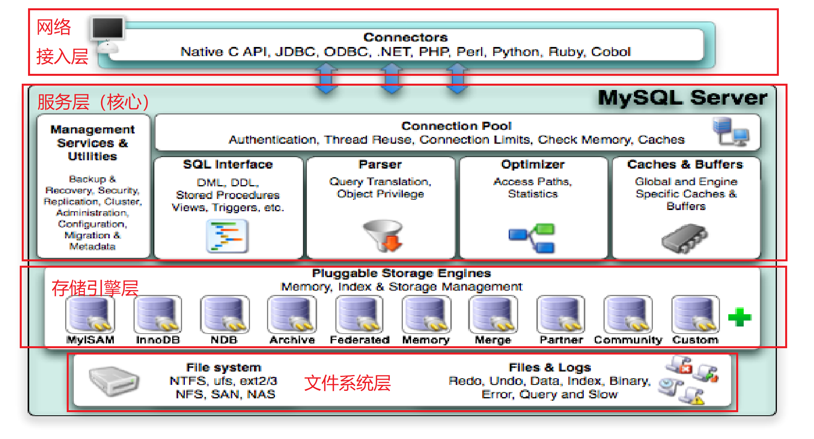
>
> <center>图1</center>
>
> 从上图我们可以知道，MySQL的体系架构划分为四层。分别为：<span style=color:yellow;background:red>**网络接入层**</span>、<span style=color:yellow;background:red>**服务层**</span>、<span style=color:yellow;background:red>**存储引擎层**</span>和<span style=color:yellow;background:red>**文件系统层**</span>。
>
> ==第一层：网络接入层==， 提供了应用程序接入MySQL服务器的接口，其功能包括**连接处理**、**身份验证**、**安全性**等等。
>
> ==第二层：服务层==，这是MySQL的核心部分，通常叫做SQL Layer。在MySQL数据库系统处理底层数据之前的所有工作都是在这一层完成的，包括**权限判断**，**SQL解析**，**执行计划优化**，查询缓存的处理以及所有内置的函数（如日期、时间、数学运算、加密）等等。各个存储引擎提供的功能也都集中在这一层，如**存储过程**、**触发器**、**视图**等等。
>
> ==第三层：存储引擎层==，通常叫做StoreEngine Layer，也就是底层数据存取操作的实现部分，由多种存储引擎共同组成。它们负责存储和获取所有存储在MySQL中的数据。当然，每个存储引擎都有自己的有点和缺陷，这个我们后续会重点学习。服务器是通过<span style=color:red;background:yellow>**存储引擎API**</span>来与它们交互的。这个API包含了很多底层的操作，比如**开始一个事务**，或者**取出有特定主键的行**。该接口隐藏了各个存储引擎不同的地方，对于查询层尽可能的透明。存储引擎不能解析SQL语句，互相之间也不能通信，仅仅是简单的响应服务器的请求。
>
> ==第四层：文件系统层==， 主要是将**数据**存储在运行于裸设备的文件系统之上，并完成与**存储引擎**的交互。

# MySQL逻辑结构

> ~(Gn!)~
>
> MySQL整体架构虽然是只有四层，但从图1中我们看到，每一层中都含有很多小模块，尤其是第二层SQL Layer，结构相当复杂。接下来，我们对每一个小模块做一个简单的介绍。
>
> 1. Connectors
>
> 不同语言的客户端与服务器建立连接，客户端发送SQL至服务器端。比如C、Java、Python等，这个我们已经很熟悉了，之前用过三种方式与服务器建立连接，如**命令行**、**Navicat**、**C语言API**，因此就不再做过多介绍了。
>
> 2. Management Services & Utilities
>
> 指的是系统管理和控制工具，比如数据库备份和恢复、主从复制、管理配置等。
>
> 3. Connection Pool
>
> 指的是连接池，管理缓冲用户连接，线程处理等需要缓存的需求。该模块负责监听对MySQL服务器的各种请求，接收连接请求，转发所有连接请求到**线程管理模块**。每一个连接上的客户端请求都会被分配（或创建）一个**连接线程**为其单独服务。而**连接线程**的主要工作就是负责MySQL服务器与客户端的通信，接收客户端的命令请求，传递服务器的结果信息等。线程管理模块则负责管理维护这些连接线程。包括线程的创建、线程的Cache等。
>
> 4. SQL Interface
>
> 指的是**SQL接口**，用来接收用户的SQL命令，并且返回用户需要查询的结果。比如DDL/DML/DQL等语句就是调用SQL接口了。
>
> 5. Parser
>
> 指的是解析器。SQL命令传递到解析器时会被解析器**验证**和**解析**。解析器是由Lex和YACC实现的，是一个很长的脚本。
>
> 在MySQL中，我们习惯将所有客户端发送给服务器的SQL命令都称为query，而不同的query是有相对应的处理模块的。在MySQL Server中，连接线程接收到客户端的一个query后，会直接将该query转发给其对应的处理模块，其主要步骤为：
>
> a. 将SQL语句进行语义和语法的分析，分解成数据结构，然后按照不同的操作类型进行分类，并转发给后续步骤。
>
> b.如果在分解过程中遇到问题，那么就说明这个SQL语句是错误的。
>
> 6. Optimizer
>
> 指的是优化器。SQL语句在查询之前会使用查询优化器对query进行优化。根据客户端发送过来的query语句，和数据库中的一些统计信息，在一系列算法的基础上进行分析，得出一个最优的策略，告诉后面的程序如何取得这个query语句的结果。
>
> 7. Cache和Buffer
>
> 指的是缓存与缓冲，由一系列缓存组成的，例如**数据缓存**、**索引缓存**以及**对象权限缓存**等。对于已经访问过的磁盘数据，在缓冲区中进行缓存，下次访问时可以直接读取内存中的数据，从而减少磁盘IO。
>
> > Cache和Buffer的区别是什么？
> >
> > 答：简单的说，Cache是读缓存，Buffer是写缓存。
>
> 8. Storage Engines
>
>    指的是存储引擎。存储引擎模块是MySQL数据库中最优特色的一点了。目前各种数据库产品中，基本上只有MySQL可以实现其底层数据存储引擎的插件式管理，该模块实际上只是一个抽象类，正是因为它成功地将各种数据处理高度抽象，才成就了今天MySQL可插拔存储引擎的特色。它提供了一系列标准的管理和服务支持，这些标准与存储引擎本身无关，而存储引擎是底层物理结构的实现，每个存储引擎开发者都可以按照自己的意愿来进行开发。包括<span style=color:yellow;background:red>**InnoDB**</span>、<span style=color:yellow;background:red>**MyISAM**</span>、Memory等。


# SQL语句执行过程

> ~(Gn!)~
>
> MySQL服务器执行客户端发送过来的一个SQL语句的整体流程，一共分为6个步骤：
>
> 1. 连接：客户端通过Connectors与MySQL服务器进行交互，向MySQL服务器发送一条查询请求。
>2. 缓存：服务器首先检查查询缓存，如果命中缓存，则立刻返回存储在其中的结果；否则进入下一个步骤。
> 3. 解析：服务器进行SQL解析（词法分析、语法分析）、预处理。
> 4. 优化：由优化器生成对应的执行计划。
>5. 执行：根据执行计划，调用存储引擎的API来执行查询。
> 6. 结果：将结果返回给客户端，同时对结果进行缓存。
>
> 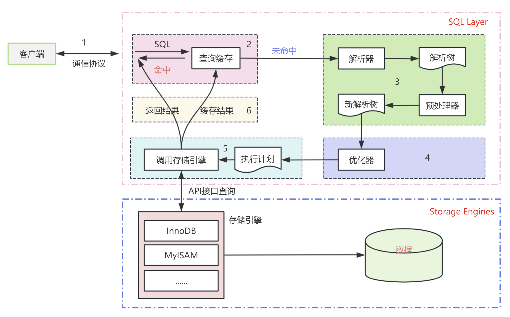
>
> 从上图中，我们可以看到一条SQL语句的完整执行流程。
>
> > Tips: 关于第二步的查询缓存，MySQL5.x和MySQL8.x的版本处理方式不同。缓存命中需要满足很多条件，如SQL语句完全相同，上下文环境相同等。实际上除非是只读应用，查询缓存的失效频率非常高，任何对表的修改都会导致缓存失效，因此MySQL8.0删除了该功能。
>
> 了解了以上知识点以后，我们就可以来考虑**如何对MySQL性能进行优化**了。


# MySQL物理结构

> ~(Gn!)~
>
> 通常我们所说的MySQL数据库其实是<span style=color:yellow;background:red>**MySQL数据库服务器**</span>，它由一个**实例**(Instance)和一个**数据库**(Database)组成。**实例**是一个后台进程，用于管理数据库；**数据库**是由一组**磁盘文件**组成，用于存储数据和日志等信息。MySQL采用的是**单进程多线程**架构，在Linux系统中可以使用ps命令进行查看:
>
> ```shell
> $ ps -elLf|grep mysqld
> ```
>
> 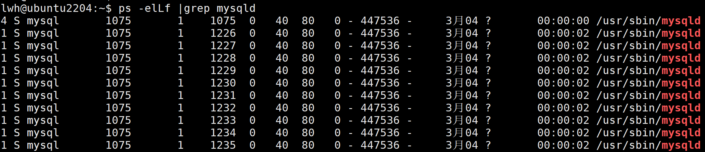
>
> 
>
> 严格来说，一个 MySQL 实例管理的是多个数据库（又叫模式，Schema）包括系统数据库 mysql、information_schema、performance_schema、sys 以及**用户创建的数据库**等。使用`SHOW DATABASES`或者`SHOW SCHEMAS`命令，可以查看当前实例中的数据库：
>
> ```mysql
> mysql> show databases;
> +--------------------+
> | Database           |
> +--------------------+
> | information_schema |
> | mysql              |
> | performance_schema |
> | sys                |
> | wangdao            |
> +--------------------+
> 5 rows in set (0.00 sec)
> ```
>
> 
> MySQL物理结构主要包括两个目录：**安装目录**和**数据目录**，以及**配置文件**和**日志文件**等。不同平台、不同安装方式（源码安装、二进制解压）的目录结构有所不同，具体地可以参考以下的MySQL官方文档：
>
> >  https://dev.mysql.com/doc/refman/8.0/en/installation-layouts.html
>
## **安装目录**
> ~(Gn!)~
>
> 安装目录(Base Directory)是MySQL服务器的安装路径，Ubuntu22.04上使用apt方式安装，其默认安装位置可以用以下命令查看:
> ```shell
> mysql> show global variables like "%basedir%";
> +---------------+-------+
> | Variable_name | Value |
> +---------------+-------+
> | basedir       | /usr/ |
> +---------------+-------+
> 1 row in set (0.01 sec)
> ```
>
> 从以上结果，可以看到Ubuntu22.04上的的默认安装目录为<span style=color:yellow;background:red>**/usr**</span>，其中主要包含以下内容：
>
> | 目录                | 描述                               | 备注 |
> | ------------------- | ---------------------------------- | ---- |
> | /usr/bin/           | mysql客户端和实用程序目录          |      |
> | /usr/sbin/          | mysqld服务器程序目录               |      |
> | /usr/include/mysql/ | mysql客户端头文件目录              |      |
> | /usr/lib/mysql/     | mysql客户端库文件目录              |      |
> | /usr/share/man/     | man帮助手册页目录                  |      |
> | /usr/share/mysql/   | 各种字符集、语言相关的错误信息目录 |      |
>
> 可以去相应目录下进行查看，比如查看<span style=color:yellow;background:red>**/usr/bin/**</span>目录下有关mysql的程序:
>
> ```shell
> $ cd /usr/bin
> $ ls | grep mysql
> ```
>
> 
>
## **数据目录**
> ~(Gn!)~
>
> 数据目录(Data Directory)是MySQL存储数据库文件的位置，Ubuntu22.04上使用apt方式安装，其默认安装位置可以用以下命令查看:
>
> ```mysql
> mysql> show global variables like '%datadir%';
>+---------------+-----------------+
> | Variable_name | Value           |
> +---------------+-----------------+
> | datadir       | /var/lib/mysql/ |
> +---------------+-----------------+
> 1 row in set (0.00 sec)
> ```
> 
> 从以上结果，可以看到Ubuntu22.04上的默认数据目录为<span style=color:yellow;background:red>**/var/lib/mysql/**</span> ，该目录使用普通用户无法访问，必须要切换到root用户，才能正常访问。
> 
>```shell
> $ su root
># cd /var/lib/mysql/
> # ls
> ```
> 
> 
> 
>其中主要包含以下内容：
> 
>| 目录或文件             | 描述                                    | 备注                                                         |
> | ---------------------- | --------------------------------------- | ------------------------------------------------------------ |
>| mysql/                 | 系统数据库mysql的文件目录               |                                                              |
> | mysql.ibd              | 系统数据库mysql的数据文件               | 在mysql8中已经没有.frm文件了                                 |
> | performance_schema/    | 性能数据库performance_schema的文件目录  |                                                              |
> | sys/                   | 系统数据库sys的文件目录                 |                                                              |
> | wangdao/               | 用户自定义数据库wangdao的文件目录       |                                                              |
> | #innodb_temp/          | InnoDB会话临时表空间目录                |                                                              |
> | #innodb_redo/          | InnoDB会话的REDO日志归档功能目录        |                                                              |
> | auto.cnf               | 当前服务器实例的UUID，用于主从复制      |                                                              |
> | binlog.*               | 二进制日志binary log相关文件            | 常用于主从复制同步数据                                       |
> | *.pem                  | SSL连接相关的证书和密钥文件             |                                                              |
> | ib_buffer_pool         | 缓冲区buffer pool中数据页的页号转储文件 |                                                              |
> | ibdata1                | InnoDB表空间文件                        |                                                              |
> | ibtmp1                 | InnoDB临时表空间文件                    |                                                              |
> | ubuntu2204.pid         | 记录mysqld的进程id，名称由主机名决定    |                                                              |
> | undo_001<br />undo_002 | InnoDB UNDO表空间文件                   | mysql8特性：从ibdata1拆分出来的innodb的<br />一些事务数据，避免ibdata1太大 |
> 

## **配置文件**
> ~(Gn!)~
> 当MySQL实例和各种工具程序启动时，需要通过配置文件读取各种参数。Ubuntu上通过apt方式安装的默认配置文件为<span style=color:yellow;background:red>**/etc/mysql/my.cnf**</span>，也可以通过以下命令来查看读取配置文件的顺序：
>
> ```shell
> # mysqld --verbose --help | grep -A 1 'Default options'
> Default options are read from the following files in the given order:
> /etc/my.cnf /etc/mysql/my.cnf ~/.my.cnf 
> ```
>
> 在Ubuntu22.04上，没有/etc/my.cnf文件，因此mysqld是从**/etc/mysql/my.cnf**中读取配置信息的。
>
> 我们通过vim打开该文件，会发现其中的内容为
>
> 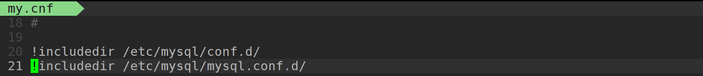
>
> 该文件的内容其实是包含了**conf.d**和**mysql.conf.d**两个目录下的配置文件，我们先进入到/etc/mysql/目录下进行查看
>
> 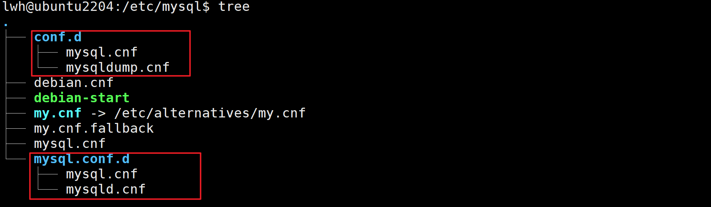
>
> 接下来，我们重点看看两个配置文件mysql.conf.d/mysql.cnf和mysql.conf.d/mysqld.cnf
>
> <span style=color:yellow;background:red>**mysql.conf.d/mysql.cnf**</span>是客户端mysql要读取的配置文件。
>
> 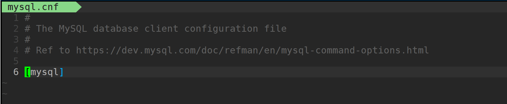
>
> 从以上文件中，我们可以看到，默认情况下，没有添加配置信息。
>
> <span style=color:yellow;background:red>**mysql.conf.d/mysqld.cnf**</span>是服务器mysqld要读取的配置文件，其中包含了很多字段，有些我们后续会学到。
>
> 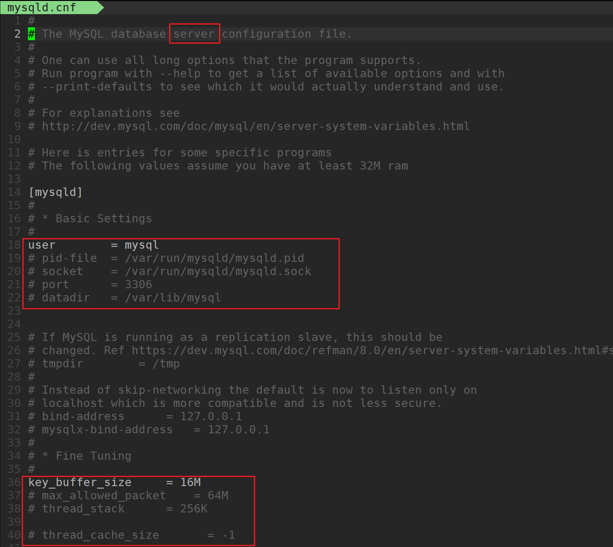
>
> 
>
## **日志文件**
> ~(Gn!)~
> mysqld的常见日志文件如下：
>
> 1. 错误日志文件：  /var/log/mysql/error.log
> 2. 慢查询日志文件：/var/log/mysql/mysql-slow.log
> 3. 主从复制文件：/var/log/mysql/mysql-bin.log
> 4. 服务器进程PID文件：/var/run/mysqld/mysqld.pid
> 5. 服务器socket文件：/var/run/mysqld/mysqld.sock
# 性能优化

> ~(Gn!)~
>
> 关于MySQL的性能优化，其实是一个比较复杂的问题，涉及到各个方面的情况。而且并不存在关于优化的“绝对真理”，我们应该关注于实际业务场景之下的具体情况，再进行具体分析。不同的业务场景，不同的MySQL服务器版本，都会使得具体的优化方案的设计出现不同。
>
> 一般情况而言，在数据库的优化上，有两个主要方向：<span style=color:yellow;background:red>**性能**</span>和<span style=color:yellow;background:red>**安全**</span>。性能指的是数据的高性能访问，安全指的是数据的安全性。下图是关于优化维度的说明：
>
> 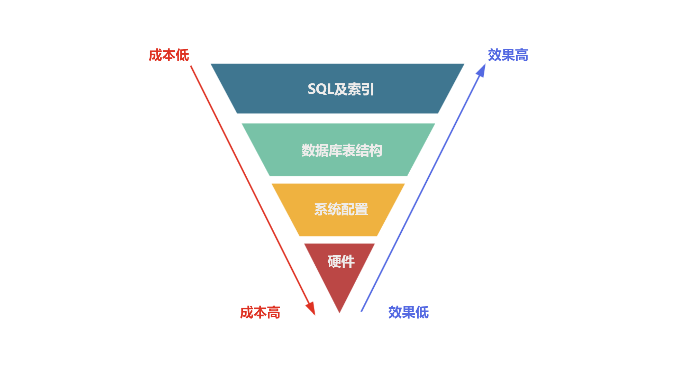
>
> 从上图中可以看出，我们把数据库的优化分成了四个维度：SQL及索引、数据库表结构、系统配置、硬件。
>
> > <span style=color:yellow;background:red>**SQL及索引**</span>：从SQL语句和索引的使用等方面进行优化。
> >
> > <span style=color:yellow;background:red>**数据库表结构**</span>：存储引擎、表设计、读写分离、分库分表、高可用等方面进行优化。
> >
> > <span style=color:yellow;background:red>**系统配置**</span>：服务器系统、数据库系统参数等方面进行优化。
> >
> > <span style=color:yellow;background:red>**硬件**</span>：从CPU、内存、存储、网络设备等方面进行优化。
>
> 从优化成本的高低来考虑(由高到低)：硬件 > 系统配置 > 数据库表结构 > SQL及索引
>
> 从<span style=color:yellow;background:red>**优化效果**</span>的高低来考虑(由高到低)：SQL及索引 > 数据库表结构 > 系统配置 > 硬件 
>
> 
>
> 大部分情况下，我们不需要进行这么全面的调优操作。一般而言，我们只需要在<span style=color:yellow;background:red>**数据库层面进行优化**</span>即可，可以从以下几个方面进行。
>
> 1. 存储引擎
> 2. 事务和并发控制
> 3. 索引（B+树）、慢查询
> 4. 执行计划
>
> 接下来，我们一一来进行研究。
## 存储引擎
> ~(Gn!)~
>
> 之前的学习，我们是从SQL语句使用的角度切入的，但数据最终是要存储到磁盘文件中的，而这与底层的存储引擎有莫大的关系。那接下来，我们先研究一下存储引擎及其特点。
>
> MySQL的存储引擎是**负责数据存储和检索的核心组件**。用大白话来说，存储引擎就是要解决以下几个问题：
>
> > 1. 如何存储数据?
> > 2. 如何为存储的数据建立<span style=color:yellow;background:red>**索引**</span>？
> > 3. 如何查询、更新数据？
>
> 插件式存储引擎是MySQL与其他数据库管理系统的最大区别。MySQL支持多种存储引擎，包括<span style=color:yellow;background:red>**InnoDB**</span>、MyISAM、MEMORY等，每种存储引擎都提供了各自的功能，用户可以根据**业务或者应用场景的不同**为**数据表**选择不同的存储引擎。
>
> 查看当前MySQL服务器的版本
>
> ```mysql
> mysql> select version();
> ```
>
> 
>
> 使用`show engines`语句可以查看当前服务器支持的存储引擎。
>
> ```mysql
> mysql> show engines;
> ```
>
> 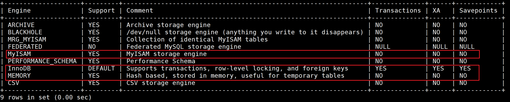
>
> 从上图的Support列中，我们可以看到，MySQL8.0.36支持8种存储引擎，而其中InnoDB成为默认的存储引擎。另外两种会使用到的存储引擎是MyISAM和MEMORY。通过以下表格，我们先来了解一下这三种存储引擎支持的功能：
>
> |                             功能                             | InnoDB  | MyISAM | MEMORY |
> | :----------------------------------------------------------: | :-----: | :----: | :----: |
> |                           存储限制                           |  64TB   | 256TB  |  RAM   |
> | 支持<span style=color:yellow;background:red>**事务**</span>  | **Yes** |   No   |   No   |
> |                           支持外键                           | **Yes** |   No   |   No   |
> |                         支持全文索引                         |   Yes   |  Yes   |   No   |
> | 支持<span style=color:yellow;background:red>**B树索引**</span> |   Yes   |  Yes   |  Yes   |
> |                         支持哈希索引                         |   Yes   |   No   |  Yes   |
> |                         支持集群索引                         |   Yes   |   No   |   No   |
> |                         支持数据索引                         |   Yes   |   No   |  Yes   |
> |                         支持数据压缩                         |   Yes   |  Yes   |   No   |
> |                          空间使用率                          |   高    |   低   |  N/A   |
>
> 下面我们一一来具体介绍一下。

### InnoDB存储引擎
>
> InnoDB是MySQL的默认事务型存储引擎，也是最重要、使用最广泛的存储引擎，没有特殊情况，都推荐使用。它被设计用来处理大量的短期事务，它的主要特点有：
>
> > 1. 支持<span style=color:yellow;background:red>**事务**</span>。默认的事务隔离级别为可重复读，通过MVCC(并发版本控制)来实现。
>> 2. 支持<span style=color:yellow;background:red>**行级锁**</span>，可以支持更高的并发。
> > 3. 为了保持数据完整性，支持<span style=color:yellow;background:red>**外键**</span>一致性约束。
> > 4. 支持自动崩溃恢复。
> > 5. 支持各种<span style=color:yellow;background:red>**索引**</span>。
>> 6. 可以通过自动增长列，方法是AUTO_INCREMENT。
> > 7. 在InnoDB中，用户数据存储在聚簇索引中，以减少基于主键的常见查询的 I/O。
>> 8. 在InnoDB中存在着缓冲管理。通过缓冲池，将索引和数据全部缓存起来，加快查询速度。
> > 9. 配合一些热备份工具可以支持真正的在线热备份。（Oracle的MySQL Enterprise Backup）
>
> 当然InnoDB的**存储表和索引**也有下面两种形式：
> 
> > 1. 使用共享表空间存储：所有的表和索引存放在同一个表空间中。（MySQL8.0）
>> 2. 使用多表空间存储：表结构放在\*.frm文件，数据和索引放在\*.ibd文件中 (MySL5.7)
> 
><span style=color:yellow;background:red>**需要增加测试，获取其在磁盘上的形式**</span>
> 
>
> 
> 对于InnoDB来说，最大的特点在于<span style=color:yellow;background:red>**支持事务**</span>。但是这是以损失效率来换取的。
> 
>我们可以通过查看表结构的创建语句，了解一张表的存储引擎类型，如
> 
>```mysql
> mysql> show create table student;
>```
> 
> 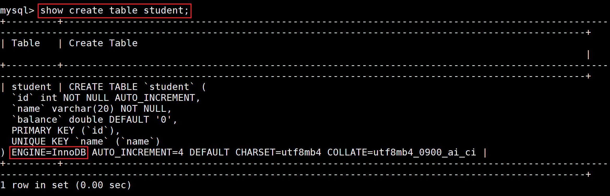
> 
> InnoDB是一个健壮的事务型存储引擎，这种存储引擎已经被很多互联网公司使用，为用户操作非常大的数据存储提供了一个强大的解决方案。在以下场合下，使用InnoDB是最理想的选择：
> 
> - 更新密集的表，即<span style=color:yellow;background:red>**频繁UPDATE/INSERT的表**</span>。 InnoDB存储引擎特别适合处理多重并发的更新请求。
> - 支持事务。 InnoDB存储引擎是支持事务的标准MySQL存储引擎。
> - 自动灾难恢复。 与其它存储引擎不同，InnoDB表能够自动从灾难中恢复（日志+事务回滚）。
> - 外键约束。 MySQL支持外键的存储引擎只有InnoDB。
> - 支持自动增加列AUTO_INCREMENT属性。
> 
### MyISAM存储引擎
>
> 在MySQL5.1及之前的版本，MyISAM是默认的存储引擎。MyISAM提供了以下的特性：
>
> > 1. 查询速度很快。
> > 2. 支持<span style=color:yellow;background:red>**全文索引**</span>。
> > 3. 支持表锁。
> > 4. 支持数据压缩。
> > 5. <span style=color:yellow;background:red>**不支持事务**</span>。
>
> MyISAM表是独立于操作系统的，这说明可以轻松地将其从Windows服务器移植到Linux服务器。
>
> 每当我们建立一个MyISAM引擎的表时，就会在本地磁盘上建立三个文件，文件名就是表名。
>
> > 1. frm文件：存储表的定义数据（MySQL5.x）
> > 2. MYD文件：存放表具体记录的数据
> > 3. MYI文件：存储索引
> > 4. **sdi**文件：存储表结构的定义数据，在MySQL8.0中被*.sdi文件取代
>
> 
>
> <span style=color:yellow;background:red>**测试**</span>：通过建表来查看
>
> ```mysql
> CREATE TABLE t_myisam(
>     id INT NOT NULL,
>     name VARCHAR(20) NOT NULL,
>     sex CHAR(3) NOT NULL,
>     birth DATE,
>     PRIMARY KEY(id)
> )ENGINE=myisam;
> ```
>
> 
>
> 由于MyISAM表**无法处理事务**，这就意味着有事务处理需求的表，不能使用MyISAM存储引擎。
>
> MyISAM存储引擎特别适合在以下几种情况下使用：
>
> > 1. 不支持事务。
> > 2. 选择密集型的表，即<span style=color:yellow;background:red>**频繁执行SELECT的表**</span>。 MyISAM存储引擎在筛选大量数据时非常迅速，这是它最突出的优点。
> > 3. 插入密集型的表，即<span style=color:yellow;background:red>**频繁执行INSERT的表**</span>。 MyISAM的并发插入特性允许同时选择和插入数据。
>
> 由此看来，MyISAM存储引擎很适合管理服务器日志数据。
>
### MEMORY存储引擎
> 
> MEMORY存储引擎将表中的数据存储到<span style=color:yellow;background:red>**内存**</span>中，为查询和引用其他表数据提供快速访问。每一个表实际上和一个磁盘文件关联，文件是\*.frm(MySQL5.x)/***.sdi(MySQL8.0)**。MEMORY存储引擎具备如下特点：
> 
>> 1. 支持的数据类型有限制，比如：**不支持TEXT和BLOB类型**，对于字符串类型的数据，只支持固定长度的行，VARCHAR会被自动存储为CHAR类型；
> > 2. 支持的锁粒度为**表级锁**。所以，在访问量比较大时，表级锁会成为MEMORY存储引擎的瓶颈；
>> 3. 由于**数据是存放在内存中**，**一旦服务器出现故障，数据都会丢失**；
> > 4. 查询的时候，如果有用到临时表，而且临时表中有BLOB，TEXT类型的字段，那么这个临时表就会转化为MyISAM类型的表，性能会急剧降低；
>> 5. 默认使用<span style=color:yellow;background:red>**hash索引**</span>。
> > 6. 如果一个**内部表**很大，会转化为**磁盘表**。
> 
> 一般在以下几种情况下，使用MEMORY存储引擎：
> 
> > 1. 目标数据较小，而且被非常频繁地访问。 在内存中存放数据，所以会造成内存的使用，可以通过参数max_heap_table_size控制Memory表的大小，设置此参数，就可以限制Memory表的最大大小。
>> 2. 如果数据是临时的，而且要求必须立即可用，那么就可以存放在内存表中。
> > 3. 存储在Memory表中的数据如果突然丢失，不会对应用服务产生实质的负面影响。
>> 4. Memory同时支持散列索引和B+树索引。

## 事务

> ~(Gn!)~
>
> 在讲解存储引擎类型时，我们接触到了一个新的概念：<span style=color:yellow;background:red>**事务**</span>。第一次接触该概念时，可能会有点儿懵。
>
> 那接下来，我们研究一下事务及其相关知识点。
>
> > 1. 什么是事务呢？
> > 2. 为什么需要事务呢？
> > 3. 事务具有哪些特性呢？
>
### 事务
><span style=color:yellow;background:red>**事务**</span>(transaction)，是数据库操作中的一组不可再分割的**逻辑执行单元**，也是数据库**并发控制**的基本单位。这个逻辑执行单元中包含了一个或一组SQL语句，它们是作为一个整体一起向系统提交的，它们**要么完全地执行**，**要么完全不执行**。如果其中一个操作不成功，这些操作都不会执行，前面执行的操作也会回滚到原状态，用来保证数据的一致性和完整性。举例说明：
> 
>在日常生活中，我们需要进行银行转账操作，该操作背后就需要执行多条SQL语句。如郭靖给黄蓉转账1000元：
> 
>> 1. 检查郭靖账户的余额是否超过1000
> > 2. 郭靖原账户的余额为T，T = T - 1000
> > 3. 黄蓉原账户的余额为S, S = S + 1000
> 
>以上三个步骤必须要包含在一个事务中，任何一个步骤失败，则必须回滚所有的步骤到原状态。
> 
>如果没有使用事务，步骤2中郭靖的账户在执行扣款后，因为一些异常情况，导致没有执行步骤3，则该转账操作就没有完成，这种情况是不允许出现的。否则郭靖的账户就平白无故的少了1000元，而黄蓉的账户上并没有加上这1000元。
> 
>而要解决该问题，这必须使用事务了。
> 
### 事务的四大特征
>
> 事务的四大特征分别是：原子性、一致性、隔离性、持久性，统称为ACID.
>
> 1. 原子性(Atomicity)
>
> 一个事务必须被视为一个不可分割的最小工作单元，整个事务中的所有操作要么全部提交成功，要么全部失败回滚。对于一个事务来说，不可能只执行其中的一部分操作，这就是事务的原子性了。
>
> 2. 一致性(Consistency)
>
> 数据库总是从一个一致性的状态转换到另一个一致性的状态。所谓一致性，指的是**数据处于一种有意义的状态**，这种状态是<span style=color:yellow;background:red>**语义**</span>上的而不是<span style=color:yellow;background:red>**语法**</span>上的，最常见的例子还是转账。例如，从郭靖的账户转一笔钱到黄蓉账户上，如果郭靖账户上的钱减少了，而黄蓉账户上的钱没有增加，那我们认为此时数据就是处于不一致的状态。
>
> 从以上描述来看，一致性可以理解为：对于实际的业务逻辑，经过相应操作以后其<span style=color:yellow;background:red>**最终结果是正确的**</span>，是与程序员所期望的结果完全符合的。
>
> 3. 隔离性(Isolation)
>
> 一个事务的执行不能被其他事务干扰。即一个事务内部的操作及使用的数据对并发的其他事务是**隔离**的，并发执行的各个事务之间不能互相干扰。尽管多个事务可能**并发执行**，但系统必须保证，对于任何一对事务T1和T2，在T1看来，T2要么在T1开始之前已经完成，要么在T1完成之后才开始执行。因此<span style=color:yellow;background:red>**每个事务都感觉不到系统中有其他事务在并发地执行**</span>。要讲清楚这个问题，这里其实会涉及到<span style=color:yellow;background:red>**事务的隔离级别**</span>，这是我们后面要学习的。
>
> 4. 持久性(Durability)
>
> 一个事务一旦提交，其对数据库中数据的修改就应该是永久性的。此时即使系统崩溃，修改的数据也不会丢失。
>
### MySQL中事务操作
>
>事务又分为显式事务和隐式事务。
>
>**显式事务**是指事务有明显的**开启**或者**结束事务**的标志。以下是显式事务的基本语法：
>
>```mysql
>mysql> BEGIN/START TRANSACTION; -- BEGIN和START TRANSACTION选择其一即可
>mysql> -- SQL statements	这里可以执行多条SQL语句
>mysql> COMMIT; -- 提交事务
>```
>
><span style=color:yellow;background:red>**测试用例**</span>
>
>假设在数据库中有一个学生表student，学生表包含了学生的学号id，姓名name，余额balance三个字段。在mysql的1号窗口中
>
>```mysql
>-- Window 1
>mysql> select * from student;
>+----+----------+---------+
>| id | name     | balance |
>+----+----------+---------+
>|  1 | liubei   |     100 |
>|  2 | zhangfei |      60 |
>+----+----------+---------+
>2 rows in set (0.00 sec)
>```
>
>查看表中的数据，发现有2条，其中学生liubei的balance为100。现在开启事务T1，将学生姓名为liubei的余额加上100
>
>```mysql
>-- Window 1
>mysql> START TRANSACTION;
>Query OK, 0 rows affected (0.00 sec)
>
>mysql> update student set balance = balance + 100 where id = 1;
>Query OK, 1 row affected (0.00 sec)
>Rows matched: 1  Changed: 1  Warnings: 0
>
>mysql> select * from student;
>+----+----------+---------+
>| id | name     | balance |
>+----+----------+---------+
>|  1 | liubei   |     200 |
>|  2 | zhangfei |      60 |
>+----+----------+---------+
>2 rows in set (0.00 sec)
>```
>
>在当前事务中，使用select语句进行查询时，可以看到学生为liubei的balance的值已经改为200了。但此时**事务并没有提交**。
>
>那我们再打开另一个mysql窗口2，在其中再次查看姓名为liubei的学生的信息。
>
>```mysql
>$ mysql -u root -p
>-- Window 2
>mysql> use wangdao; -- 进入数据库
>mysql> select * from student; -- 查看表数据
>+----+----------+---------+
>| id | name     | balance |
>+----+----------+---------+
>|  1 | liubei   |     100 |
>|  2 | zhangfei |      60 |
>+----+----------+---------+
>2 rows in set (0.00 sec)
>```
>
>发现学生liubei的balance还是100，从这里就看到事务的效果了，**只要事务没提交，操作就没有生效。**
>
>那我们接着回到窗口1的事务T1，执行提交COMMIT
>
>```mysql
>-- Window 1
>mysql> COMMIT;
>```
>
>之后再在2号窗口中进行查看，此时会发现学生liubei的balance真正发生了改变。
>
>```mysql
>-- Window 2
>mysql> select * from student;
>+----+----------+---------+
>| id | name     | balance |
>+----+----------+---------+
>|  1 | liubei   |     200 |
>|  2 | zhangfei |      60 |
>+----+----------+---------+
>2 rows in set (0.00 sec)
>```
>
>
>
>**回滚事务**
>
>如果执行中出现错误或者需要撤销操作，则在提交事务之前，可以使用ROLLBACK语句来回滚事务
>
>```mysql
>mysql> BEGIN/START TRANSACTION; -- BEGIN和START TRANSACTION选择其一即可
>mysql> -- SQL statements	这里可以执行多条SQL语句
>mysql> ROLLBACK; -- 回滚事务
>```
>
><span style=color:yellow;background:red>**测试用例**</span>
>
>开启事务T2
>
>```mysql
>mysql> BEGIN；
>mysql> update student set balance = balance + 100 where id = 1;
>Query OK, 1 row affected (0.00 sec)
>Rows matched: 1  Changed: 1  Warnings: 0
>
>mysql> select * from student;
>+----+----------+---------+
>| id | name     | balance |
>+----+----------+---------+
>|  1 | liubei   |     300 |
>|  2 | zhangfei |      60 |
>+----+----------+---------+
>2 rows in set (0.01 sec)
>-- 如果发现操作错误，此时执行ROLLBACK
>mysql> ROLLBACK;
>-- 再次查看数据
>mysql> select * from student;
>+----+----------+---------+
>| id | name     | balance |
>+----+----------+---------+
>|  1 | liubei   |     200 |
>|  2 | zhangfei |      60 |
>+----+----------+---------+
>2 rows in set (0.00 sec)
>-- 发现数据已经回到更新之前的数据了
>```
>
>
>
>**回滚点**
>
>在事务执行过程中，如果我们只想回滚部分数呢，此时该怎么做呢？
>
>我们可以在MySQL事务处理过程中定义**保存点**，然后回滚到指定的保存点前的状态，因此保存点又称为**回滚点**。
>
>以下是回滚点的基本语法：
>
>```mysql
>mysql> BEGIN/START TRANSACTION; -- BEGIN和START TRANSACTION选择其一即可
>mysql> -- SQL statements
>mysql> SAVEPOINT identifer   -- 创建一个名为identifier的回滚点
>mysql> -- SQL statements
>mysql> ROLLBACK TO [SAVEPOINT] identifier   -- 回滚到指定名称的回滚点，这里是identifier
>mysql> RELEASE SAVEPOINT identifier  -- 释放删除回滚点identifier
>mysql> COMMIT; -- 提交事务
>```
>
>注意：
>
>> 1. 回滚点**只能使用在当前事务中**，如果提交事务或新开事务，保存点会失效。
>>
>> 2. 回滚点的**名称必须唯一**，并且不能包含特殊字符或空格。
>
>通过设置回滚点，可以更好地管理和保护数据。在MySQL中使用回滚点，可以避免以外更改数据库而损坏数据，提高数据一致性和可靠性。
>
><span style=color:yellow;background:red>**测试用例**</span>
>
>开启事务T3
>
>```mysql
>-- Window 1
>mysql> BEGIN;
>Query OK, 0 rows affected (0.00 sec)
>
>mysql> select * from student;
>+----+----------+---------+
>| id | name     | balance |
>+----+----------+---------+
>|  1 | liubei   |     200 |
>|  2 | zhangfei |      60 |
>+----+----------+---------+
>2 rows in set (0.00 sec)
>-- 第一次执行更新操作，给id为1的学生的balance值加100
>mysql> update student set balance = balance + 100 where id = 1;
>Query OK, 1 row affected (0.00 sec)
>Rows matched: 1  Changed: 1  Warnings: 0
>-- 在事务内部查询，已经添加成功
>mysql> select * from student;
>+----+----------+---------+
>| id | name     | balance |
>+----+----------+---------+
>|  1 | liubei   |     300 |
>|  2 | zhangfei |      60 |
>+----+----------+---------+
>2 rows in set (0.00 sec)
>-- 设置回滚点p1，此时liubei的balance为300
>mysql> SAVEPOINT p1;
>Query OK, 0 rows affected (0.00 sec)
>-- 执行第二次更新操作
>mysql> update student set balance = balance + 200 where id = 1;
>Query OK, 1 row affected (0.00 sec)
>Rows matched: 1  Changed: 1  Warnings: 0
>-- 再次查看数据，已经更新
>mysql> select * from student;
>+----+----------+---------+
>| id | name     | balance |
>+----+----------+---------+
>|  1 | liubei   |     500 |
>|  2 | zhangfei |      60 |
>+----+----------+---------+
>2 rows in set (0.00 sec)
>-- 此时要回滚到第一次更新时的状态，则只需要回滚到p1回滚点即可
>mysql> ROLLBACK TO p1;
>Query OK, 0 rows affected (0.00 sec)
>-- 查看数据时，已回到p1回滚点的状态
>mysql> select * from student;
>+----+----------+---------+
>| id | name     | balance |
>+----+----------+---------+
>|  1 | liubei   |     300 |
>|  2 | zhangfei |      60 |
>+----+----------+---------+
>2 rows in set (0.00 sec)
>
>-- 执行第三次更新操作
>mysql> update student set balance = balance + 200 where id = 1;
>-- 释放删除回滚点p1
>mysql> RELEASE SAVEPOINT p1;
>-- 回滚点无法使用
>myslq> ROLLBACK TO p1; 
>ERROR 1305 (42000): SAVEPOINT p1 does not exist
>
>-- 提交事务，修改写入到数据库中
>mysql> COMMIT;
>Query OK, 0 rows affected (0.00 sec)
>```
>
>在另一个窗口2中查看数据状态，发现事务T3的提交已经成功。
>
>```mysql
>-- Window 2
>mysql> select * from student;
>+----+----------+---------+
>| id | name     | balance |
>+----+----------+---------+
>|  1 | liubei   |     500 |
>|  2 | zhangfei |      60 |
>+----+----------+---------+
>2 rows in set (0.00 sec)
>```
>
>
>
>**隐式事务**是指事务**没有**明显的开启或者结束的标志，执行SQL语句时，数据库会<span style=color:yellow;background:red>**自动开启、提交或回滚事务**</span>。我们未学习事务时，就是采用的隐式事务，一切操作起来都没有什么问题。
>
>在MySQL8.0.36中，默认开启了隐式事务，是否开启隐式事务是由变量autocommit控制的，我们可以通过以下命令查看：
>
>```mysql
>mysql> show variables like 'autocommit';
>+---------------+-------+
>| Variable_name | Value |
>+---------------+-------+
>| autocommit    | ON    |
>+---------------+-------+
>1 row in set (0.00 sec)
>```
>
>autocommit为ON，表示开启了自动提交。如果希望控制自动提交事务的开启和关闭，也可以使用以下语句：
>
>```mysql
>mysql> set autocommit=0; -- 关闭事务的自动提交
>mysql> set autocommit=1; -- 开启事务的自动提交
>```
>
><span style=color:yellow;background:red>**测试用例**</span>
>
>在窗口1中
>
>```mysql
>-- Window 1
>mysql> set autocommit=0; -- 关闭事务的自动提交
>Query OK, 0 rows affected (0.00 sec)
>
>mysql> show variables like 'autocommit';
>+---------------+-------+
>| Variable_name | Value |
>+---------------+-------+
>| autocommit    | OFF   |
>+---------------+-------+
>1 row in set (0.00 sec)
>-- 自动提交功能已关闭
>-- 查看数据情况
>mysql> select * from student;
>+----+----------+---------+
>| id | name     | balance |
>+----+----------+---------+
>|  1 | liubei   |     300 |
>|  2 | zhangfei |      60 |
>+----+----------+---------+
>2 rows in set (0.00 sec)
>-- 更新id为1的学生信息
>mysql> update student set balance=balance+100 where id = 1;
>Query OK, 1 row affected (0.00 sec)
>Rows matched: 1  Changed: 1  Warnings: 0
>-- 好像已经更新完毕了
>mysql> select * from student;
>+----+----------+---------+
>| id | name     | balance |
>+----+----------+---------+
>|  1 | liubei   |     400 |
>|  2 | zhangfei |      60 |
>+----+----------+---------+
>2 rows in set (0.00 sec)
>```
>
>在窗口2中进行验证
>
>```mysql
>-- Window 2
>mysql> select * from student;
>+----+----------+---------+
>| id | name     | balance |
>+----+----------+---------+
>|  1 | liubei   |     300 |
>|  2 | zhangfei |      60 |
>+----+----------+---------+
>2 rows in set (0.00 sec)
>```
>
>从以上情况来看，id为1的学生信息并没有进行修改而写入数据库中。这就是<span style=color:yellow;background:red>**关闭自动提交**</span>之后的效果了。
>
>
>
>**总结**
>
>显式事务和隐式事务都可以保证数据的一致性和完整性，但它们有所不同。
>
>1. 应用场景不同。
>
>显式事务适用于需要**进行一组操作**，并在操作完成后手动提交或回滚事务的场景。显式事务可以提供更精细的控制，但需要额外的代码和逻辑来实现。
>
>隐式事务适用于**单个操作**，如果操作成功，则自动提交事务，如果操作失败，则自动回滚事务。隐式事务可以提供更简洁的代码和更高的开发效率，但无法进行更复杂的控制。
>
>2. 性能不同
>
>显式事务和隐式事务在性能方面也有所不同。显式事务需要更多的系统资源来维护事务状态和锁定机制，而隐式事务则更轻量级，适用于高并发和大规模的操作场景。
### 并发访问带来的问题
>**前置知识**
>
>> Tips: 什么是并发和并行？可参考 https://c.biancheng.net/view/9486.html
>
>**并发访问带来的问题**
>
>在并发访问数据库时，不触及相同数据的事务可以安全地并发，只有当一个事务读取另一个事务正在修改的数据时，或者两个事务试图同时修改相同的数据时，并发问题才会出现。如果对事务没有进行并发控制，则可能会产生几种异常情况：脏读、不可重复读、幻读、丢失修改（脏写）。
>
>并发访问时，假设有两个事务对相同的数据进行读写操作。那就涉及到三种组合：读-读、读-写、写-写。很显然，两个事务对同一数据做读操作，不会存在任何问题。而**读-写组合**以及**写-写组合**就会碰到问题。
>
>> 1. 脏读(Dirty Read)：一个事务读取到另一个事务没有提交的修改，就是当另一个事务还没有提交修改，一个事务就读取到了修改。（<span style=color:yellow;background:red>**读-写**</span>）
>> 2. 不可重复读(Nonrepeatable Read)：一个事务重复读两次得到不同结果，说明读取操作结果是不可重复的。（<span style=color:yellow;background:red>**读-写**</span>）
>> 3. 幻读(Phantom Read)：一个事务第二次查询出现第一次没有的结果，说明别的事务已经插入一些数据。（<span style=color:yellow;background:red>**读-写**</span>）
>> 4. 丢失更新(lost update)：并发写入，造成其中一些更新丢失。（<span style=color:yellow;background:red>**写-写**</span>）
>
>
>
>**丢失更新**(情况最严重)
>
>丢失更新分为两种情况：回滚丢失和覆盖丢失。
>
>回滚丢失：事务T1的回滚覆盖了事务T2已经提交的结果。
>
>覆盖丢失：事务T1的提交覆盖了事务T2已经提交的结果。
>
>1. 我们先来看<span style=color:yellow;background:red>**回滚丢失**</span>的情况。
>
>事务T1和T2初始情况时，获取的账户余额都为1000元，事务T2率先存入了500元，并进行了提交，账户余额为<span style=color:yellow;background:red>**1500**</span>元。而在事务T1中，取出200元后，回滚了事务，这样就会覆盖T2提交的更新，账户余额仍为<span style=color:yellow;background:red>**1000**</span>元。
>
>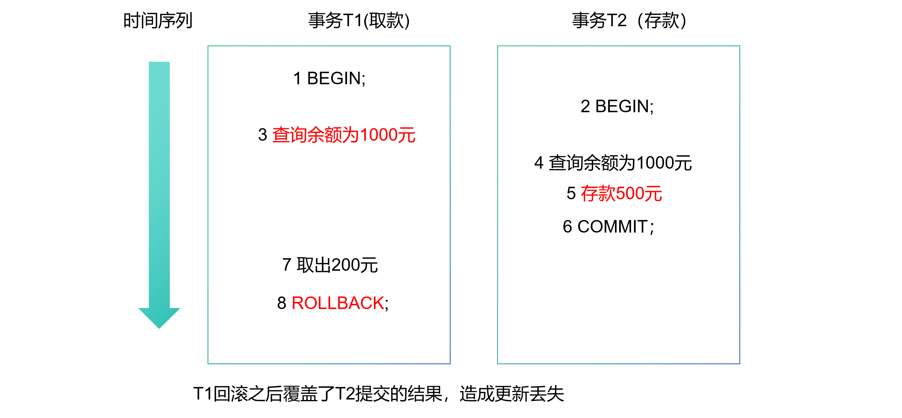
>
>2. 接下来是覆盖丢失的情况
>
>事务T1和T2初始情况时，获取的账户余额都为1000元，事务T2率先存入了500元，并进行了提交，账户余额为<span style=color:yellow;background:red>**1500**</span>元。而在事务T1中，取出200元后，提交事务，这样就会覆盖T2提交的更新，账户余额为<span style=color:yellow;background:red>**800**</span>元。
>
>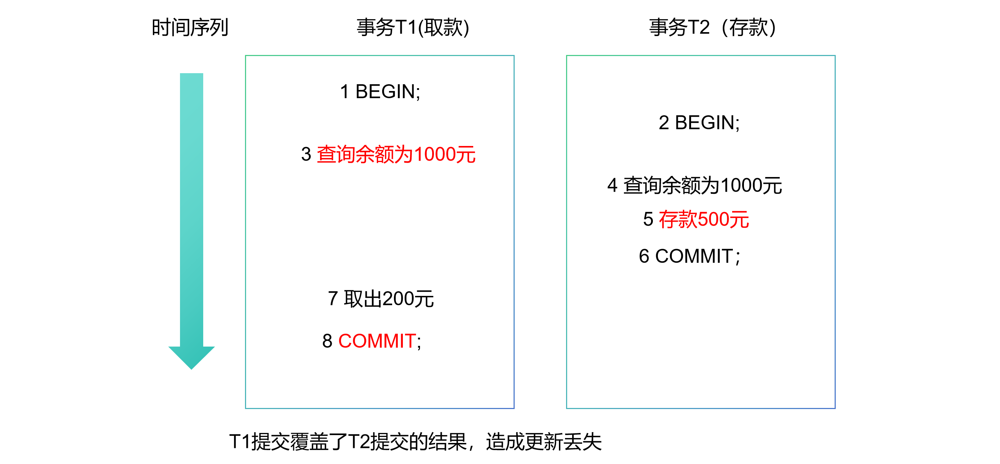
>
>
>
>**脏读**
>
>事务T1是存款操作，事务T2是取款操作，事务T1在第5个步骤中读取了事务T2尚**未提交的数据**，此时如果事务T2发生错误而进行回滚操作，如下图第6个步骤，那么事务T1读取到的数据就是**脏数据**。事务T1经过步骤7和8，账户最终余额锁定为2500元，但很显然该数据是错误的，正确的余额应该为3000元。
>
>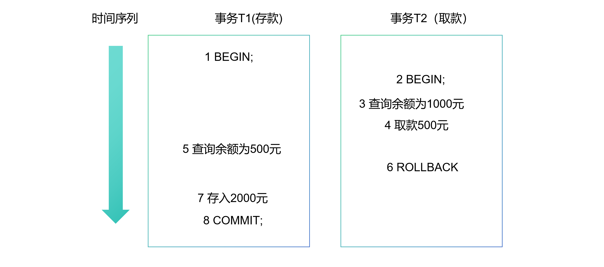
>
>
>
>**不可重复读**：前后多次读取，数据内容不一致
>
>在事务T1中多次读取数据，前后查询出来的账户余额不一致。事务T1中步骤2，第一次查询出来的余额为1000元，在事务T2中步骤6执行完毕之后，事务T1中步骤7查询出来的余额为500元。同一个事务T1，前后两次的数据不相同，这样的现象称为不可重复读。
>
>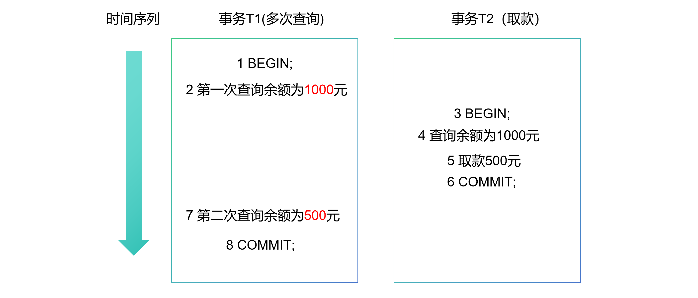
>
>
>
>**幻读**：前后多次读取，数据总量不一致
>
>事务T1在执行读取操作，需要两次统计数据的总量，前一次查询数据总量后，此时事务T2执行了新增数据的操作并提交后，这个时候事务T1读取的数据总量和之前统计的不一样，就像产生了**幻觉**一样，平白无故的多了几条数据，成为**幻读**。
>
>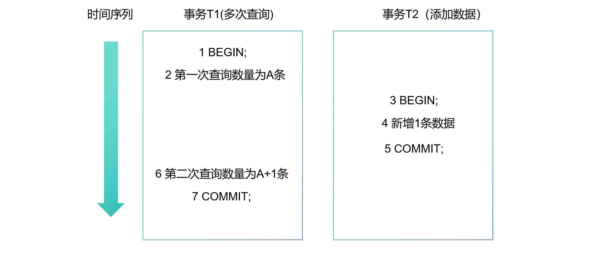
>
>
>
>**总结**：
>
>1. 脏读是读取了其他事务未提交的数据。
>2. 不可重复读是读取了其他事务已提交的数据，针对于Update操作。
>3. 幻读是读取了其他事务新增或减少了的数据，针对于Insert和Delete操作。


### 事务隔离级别

>**事务隔离级别**主要是解决了上述多个事务之间数据可见性及数据正确性的问题（四种问题）。为了解决并发访问可能产生的异常问题，**SQL标准**定义了四种事务隔离级别。
>
>> 1. 读未提交(Read Uncommitted)
>> 2. 读已提交(Read Committed)
>> 3. 可重复读(Repeatable Read)
>> 4. 可串行化(Serializable)
>
>**读未提交（Read Uncommitted）**
>
>读未提交，也叫未提交读，该隔离级别的事务可以看到其他事务中未提交的数据。该隔离级别因为可以读取到其他事务中未提交的数据，而未提交的数据可能会发生回滚，因此我们把该级别读取到的数据称之为脏数据，把这个问题称之为**脏读**。这个级别会导致很多问题，除非真的有非常必要的理由，在实际应用中一般很少使用。
>
>**读已提交(Read Committed)**
>
>读已提交，也叫提交读，该隔离级别的事务能读取到已经提交事务的数据，因此它**不会有脏读问题**。但由于在事务的执行中可以读取到其他事务提交的结果，所以在不同时间的相同 SQL 查询中，可能会得到不同的结果，这种现象叫做**不可重复读**。大多数数据库系统的默认隔离级别都采用这个级别，但MySQL除外。
>
>**可重复读(Repeatable Read)**
>
>可重复读，是 **MySQL 的默认事务隔离级别**，它能确保同一事务多次查询的结果一致。但也会有新的问题，比如此级别的事务正在执行时，另一个事务成功的插入了某条数据，但因为它每次查询的结果都是一样的，所以会导致查询不到这条数据，自己重复插入时又失败（因为唯一约束的原因）。明明在事务中查询不到这条信息，但自己就是插入不进去，这就叫**幻读** （Phantom Read）。
>
>**串行化(Serializable)**
>
>串行化，**事务最高隔离级别**，它会强制事务排序，使之不会发生冲突，从而解决了脏读、不可重复读和幻读问题，但因为执行效率低，所以真正使用的场景并不多。
>
>
>
>**总结**：各种隔离级别中会出现的问题如下：
>
><span style=color:yellow;background:red>**√ ： 表示问题已解决**</span>
>
><span style=color:yellow;background:red>**×：表示问题未解决**</span>
>
>|          隔离级别           | 丢失更新 | 脏读 | 不可重复读 | 幻读 |
>| :-------------------------: | :------: | :--: | :--------: | :--: |
>| 读未提交RU(Read Uncommited) |    √     |  ×   |     ×      |  ×   |
>|  读已提交RC(Read Commited)  |    √     |  √   |     ×      |  ×   |
>| 可重复读RR(Repeatable Read) |    √     |  √   |     √      |  ×   |
>|    串行化S(Serializable)    |    √     |  √   |     √      |  √   |
>
>从上述该表，我们可以发现：
>
>- 四种隔离级别都解决了丢失更新的问题。
>- RU隔离级别没有解决脏读、不可重复读、幻读的问题。
>- RC隔离级别没有解决不可重复读、幻读的问题。
>- RR隔离级别没有解决幻读的问题。
>
>**查询事务的隔离级别**
>
>在MySQL8.0.36中，使用以下命令查询事务的隔离级别
>
>```mysql
>mysql>select @@transaction_isolation;        -- 查询当前会话的隔离级别
>mysql>select @@global.transaction_isolation; -- 查看全局的隔离级别
>
>-- 测试如下
>mysql> select @@global.transaction_isolation,@@transaction_isolation;
>+--------------------------------+-------------------------+
>| @@global.transaction_isolation | @@transaction_isolation |
>+--------------------------------+-------------------------+
>| REPEATABLE-READ                | REPEATABLE-READ         |
>+--------------------------------+-------------------------+
>1 row in set (0.00 sec)
>```
>
>
>
>**查询与服务器建立好连接的客户端**
>
>我们之前学过，与MySQL服务器建立连接的方式有3种，分别是<span style=color:yellow;background:red>**命令行、GUI、API接口**</span>。每建立一个连接，我们可以使用以下查看建立好连接的客户端情况：
>
>```mysql
>mysql>show processlist;
>```
>
>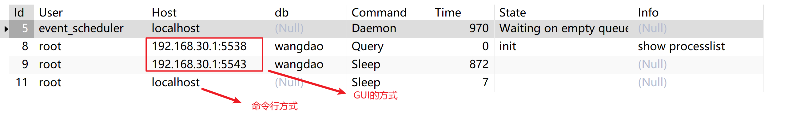
>
>如果想要获取客户端连接的数量，也可以使用如下命令来获取：
>
>```mysql
>mysql> show status like 'Threads%';
>```
>
>
>
>每个客户端可以认为是一个会话，而每个会话都可以单独设置事务的隔离级别，可以使用如下命令：
>
>```mysql
>mysql> set session transaction isolation level Read Uncommitted;
>mysql> set session transaction isolation level Read Committed;
>mysql> set session transaction isolation level Repeatable Read;
>mysql> set session transaction isolation level Serializable;
>```
>
>
>
>**注意**：MySQL 8.0 版本中所有的隔离级别都没有出现更新丢失问题，即 MySQL8.0版本的隔离级别默认都是可以解决更新丢失问题的，所以，**更新丢失的情况并不好模拟**。不过可以通过测试，证明更新丢失情况不会发生。
>
>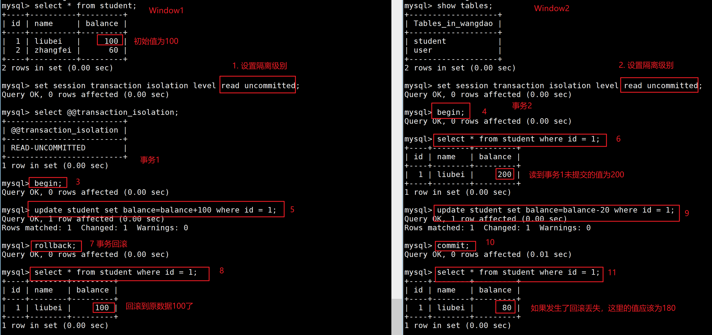
>
><span style=color:yellow;background:red>**增加测试用例**</span>


## MySQL索引

> ~(Gn!)~
> 什么是数据库索引呢？
>
> 数据库索引是一种<span style=color:yellow;background:red>**数据结构**</span>，用于提高数据库查询的速度和效率。<span style=color:yellow;background:red>**索引**</span>类似于**书籍的目录**，它们存储了表中列值的快速引用，使得MySQL可以更快地定位和检索特定行。当你在MySQL数据库表上创建索引时，MySQL会根据指定的列或表达式创建一个额外的数据结构，以帮助加速数据检索操作。
>
> <span style=color:yellow;background:red>**索引的存储原理**</span>大致可以用一句话概括：<span style=color:yellow;background:red>**以空间换时间**</span>。一般来说索引本身也很大，不可能全部存储在内存中，因此索引往往是存储在磁盘上的文件中的（可能存储在单独的索引文件中，也可能和数据一起存储在数据文件中）。

### MySQL的索引分类
>
> MySQL中索引的名字有很多，我们需要对他们进行分类，然后再逐一解析。可以从以下几个方面来进行分类：
>
> - 按**字段特性**可以分为：主键索引、唯一索引、普通索引。
> - 按**字段个数**可以分为：单列索引、联合（复合）索引。
> - 按**数据结构**可以分为：B+树索引、哈希索引、全文索引。
> - 按**物理存储**可以分为：聚簇索引（主键索引）、二级索引（辅助索引）。
>
> 接下来，我们逐一进行学习。
>

### **按字段特性分类**
>
>从字段特性的角度来看，索引分为主键索引、唯一索引、普通索引。
>
>**主键索引**
>
>主键索引（Primary Key）就是建立在主键字段上的索引，通常在创建表的时候一起创建，一张表最多只有一个主键索引，索引列的值不允许有空值。
>
>在创建表时，创建主键索引的语法：
>
>```sql
># 方式一
>CREATE TABLE table_name (
>	column_1 datatype PRIMARY KEY,
>	column_2 datatype,
>	...
>);
>
># 方式二：
>CREATE TABLE table_name(
>	column_1 datatype,
>	column_2 datatype,
>	...
>	PRIMARY KEY(column_1)
>);
>```
>
>如果你想在已存在的表中添加主键，可以使用以下语法：
>
>```sql
>ALTER TABLE table_name ADD PRIMARY KEY (column_x);
>```
>
>在以上两种情况下，column_1 是你想要作为主键的列名，datatype 是该列的数据类型。<span style=color:yellow;background:red>**主键必须唯一且非空**</span>。MySQL会自动创建一个名为 PRIMARY 的索引来实现主键的唯一性和快速查找。
>
>
>
>**唯一索引**
>
>唯一索引是建立在 **UNIQUE** 字段上的索引，一张表可以有多个唯一索引，索引列的值必须唯一，但是允许有空值。
>
>在创建表时，创建唯一索引的语法如下：
>
>```sql
># 方式一: 在定义某个字段时，在其约束中加上UNIQUE字段
>CREATE TABLE table_name  (
>	column_1 datatype,
>	column_2 datatype UNIQUE,
>	...
>);
># 方式二
>CREATE TABLE table_name  (
>column1 datatype,
>	column2 datatype,
>	...
>	UNIQUE KEY(column_x) 
>);
>```
>
>如果你想在已经存在的表上添加唯一索引，可以使用以下语法：
>
>```sql
>ALTER TABLE table_name
>ADD UNIQUE INDEX [index_name](column_x);
>```
>
>
>
>**普通索引**
>
>普通索引就是建立在普通字段上的索引，既不要求字段为主键，也不要求字段为 UNIQUE。
>
>在创建表时，创建普通索引的语法如下：
>
>```sql
>CREATE TABLE table_name  (
>....
>INDEX [index_name] (column_x) 
>);
>```
>
>如果你想在已经存在的表上创建普通索引，可以使用以下语法：
>
>```sql
>CREATE INDEX index_name ON table_name(column_x); 
>```
>
### 按字段个数分类
>从字段个数的角度来分，索引可以分为单列索引、联合索引（复合索引）。建立在单列上的索引称为单列索引，比如之前所学的主键索引等。而建立在多列上的索引称为联合索引。
>
>**联合索引**
>
>通过将多个字段组合在一起成为一个索引，该索引就称为**联合索引**。
>
>语法形式如下：
>
>```sql
># 唯一索引之联合索引
>CREATE TABLE table_name  (
>....
>UNIQUE KEY(column_1,column_2,...) 
>);
>
>CREATE UNIQUE INDEX index_name
>ON table_name(column_1,column_2,...); 
>
># 普通索引之联合索引，创建表时设置
>CREATE TABLE table_name  (
>....
>INDEX(column_1,column_2,...) 
>);
>
># 普通索引之联合索引，表已经存在时创建
>CREATE INDEX index_name on table_name(column1, column2,...);
>```
>
>
>
>**最左前缀匹配原则**
### 按数据结构分类
>从数据结构的角度来看，MySQL常见索引有**B+Tree索引**、**Hash索引**和**全文索引**。而每一种存储引擎支持的索引类型不一定相同，具体可以参考之前的表格。
>
><span style=color:yellow;background:red>**InnoDB**</span>存储引擎在MySQL5.5之后，成为<span style=color:yellow;background:red>**默认的MySQL存储引擎**</span>。**B+Tree索引**也是MySQL目前使用最多的索引类型。
>
><span style=color:yellow;background:red>**增加测试用例**</span>
>
>```mysql
>mysql> SHOW INDEX FROM table_name;
>```
>
>
>
>**HASH索引**
>
>我们先来在InnoDB存储引擎中使用Hash索引
>
>```mysql
>CREATE TABLE test_hash(
>id int(11) NOT NULL,
>name varchar(20) unique,
>INDEX hash_idx(id) USING HASH
>)ENGINE=InnoDB;
>
>SHOW INDEX FROM test_hash;
>```
>
>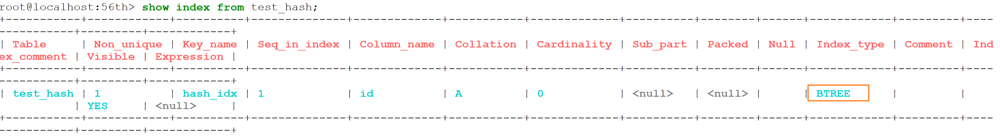
>
>在MEMORY中使用Hash索引
>
>```mysql
>CREATE TABLE test_hash(
>id int(11) NOT NULL,
>name varchar(20) unique,
>PRIMARY KEY(id) USING HASH
>)ENGINE=MEMORY;
>
>SHOW INDEX FROM test_hash;
>```
>
>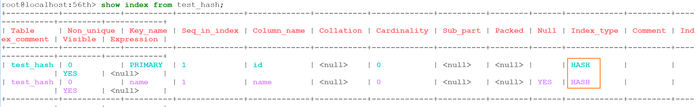
>
>**注意**：通过以上测试，我们发现无法通过InnoDB存储引擎在表中创建Hash索引。经典的书籍【MySQL技术内幕InnoDB存储引擎.姜承尧】中也提到了这点，<span style=color:yellow;background:red>**不能人为干预是否在一张采用InnoDB存储引擎的表中生成Hash索引**</span>。
>
>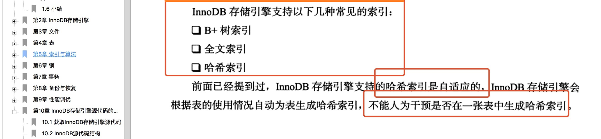
>
>那为什么我们说InnoDB存储引擎支持哈希索引呢？其实InnoDB支持Hash索引是自适应的。**自适应Hash索引特性**使InnoDB能够在具有适当的工作负载和**足够的缓冲池内存**的系统上执行更像内存中的数据库，而不牺牲事务特性或可靠性，总的来说是为了提高查询性能。即InnoDB在**内部**利用Hash索引来实现自适应Hash索引特性。那如何开启该特性呢？
>
>我们可以在启动命令中，加上 <span style=color:yellow;background:red>**--innodb-adaptive-hash-index**</span> 就可以开启InnoDB 自适应索引的特性了。
>
>
>
>**全文索引**
>
>```mysql
>-- 创建表
>CREATE TABLE products (
>    id INT PRIMARY KEY AUTO_INCREMENT,
>    name VARCHAR(255),
>    description TEXT
>);
>
>-- 添加全文索引
>ALTER TABLE products
>ADD FULLTEXT INDEX idx_name_description (name, description);
>
>-- 执行全文搜索查询
>SELECT * FROM products WHERE MATCH(name, description) AGAINST('keyword');
>```
### 按物理存储分类
>从物理存储的角度来看，索引分为聚簇索引（主键索引）、二级索引（辅助索引）。这两者的区别如下：
>
>- 聚簇(主键)索引的B+Tree的叶子节点存放的是实际数据。
>- **二级索引**的B+Tree的叶子节点存放的是<span style=color:yellow;background:red>**主键值**</span>，而**不是实际数据**。
>
>聚簇索引（Clustered Index），也叫簇类索引或聚集索引，是一种对磁盘上实际数据重新组织以按指定的一个或多个列的值排序的存储方式。它类似于电话簿，按照姓氏排列数据。聚簇索引的索引页面指针指向数据页面，使得使用聚簇索引查找数据通常比使用非聚簇索引更快。
>
>在数据库中，**聚簇索引**是按照每张表的主键构造一颗B+树，同时叶子节点中存放的就是整张表的行记录数据，因此也被称为数据页。这个特性决定了索引组织表中数据也是索引的一部分，每张表只能拥有一个聚簇索引。如果表中没有定义主键，某些数据库管理系统（如InnoDB）会选择一个唯一的非空索引代替；如果没有这样的索引，则会隐式定义一个主键来作为聚簇索引。
>
>在查询时，如果使用了二级索引，查询的数据如果不在二级索引里，就会先检索二级索引，找到对应的叶子节点，获取到主键值后，再查询主键索引，就能查询到数据，这个过程称为<span style=color:yellow;background:red>**回表**</span>；如果查询的数据就在二级索引里，就不需要回表。
## 为什么MySQL要使用B+Tree作为索引呢？
>这个问题其实是面试时经常会碰到的问题，是一个**高频考点**。要回答这个问题，其实不仅仅是要从**数据结构**的角度考虑，还需要考虑**磁盘I/O的操作次数**，毕竟MySQL的数据（索引+记录）是存储在磁盘中的，这样即使断电了，数据也不会丢失。
>
>众所周知，相对于内存来说，磁盘I/O的速度是很慢的。我们从头来捋一捋，由于数据库的索引是保存在磁盘上的，当我们通过索引来查找某行记录时，就需要先从磁盘读取索引到内存，然后通过索引获取记录在磁盘中的位置后，再次从磁盘中读取某行数据。从这个过程来看，查询某行记录的过程中，会发生多次磁盘I/O的操作，而磁盘I/O的次数越多，所消耗的时间也越大。因此，为了尽快从磁盘中读取到数据存入内存，我们在设计索引的数据结构时，需要尽可能地减少磁盘I/O的次数，这样消耗的时间也更少。
>
>此外，我们知道MySQL是支持范围查找的，那索引的数据结构也必须要能高效的进行范围查找。因此设计一个适合的索引数据结构，至少需要满足以下几个要求：
>
>- 要能进行排序，高效地查询某一条记录。
>- 要能高效地执行范围查找。
>- 磁盘I/O次数尽可能少。
>
>目前我们所学的数据结构中支持查找的有以下几种：
>
>- 哈希查找：哈希表
>- 顺序查找：数组、链表
>- 二分查找：二叉排序树、AVL树、红黑树
>
### 哈希查找
>说到查找，最快的莫过于哈希查找了，只要hash函数设计得当，基本上查找就是O(1)的时间复杂度了，速度最快。但是Hash索引本身由于其特殊性也带来了很多限制和弊端，主要有：
>
>- 哈希索引只支持等值比较查询，不支持范围查询。
>- 哈希索引数据并不是按照索引值顺序存储的，所以也就无法用于排序。
>- 大多数场景下，都有范围查找、分组、排序等查询特征，不适合使用哈希索引。
>
>**示例**
>
>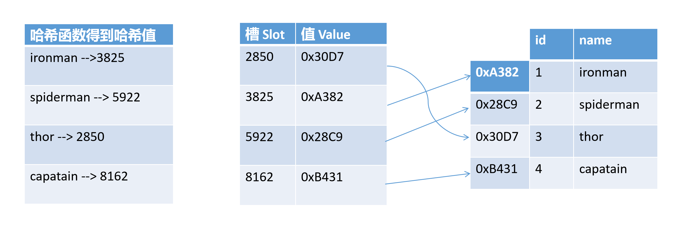
>
### **二分查找**
>因为要支持排序，索引数据应该是有序的，如果直接使用顺序查找，其时间复杂度太高，我们就不讨论了。我们直接从二分查找开始进行讨论。采用二分查找，并且支持排序的，大家可能会想到**有序数组**。如果我们使用有序数组来作为索引，那会涉及到一个数据插入的问题，当数组插入数据时，其时间复杂度比较高，尤其是还要写入到磁盘中，那就更是一种灾难了，所以是不适合作为索引的数据结构的。因此我们很自然就会想到**二叉搜索树**。
>
>二叉搜索树，又称为二叉排序树，其特点是：
>
>- 一个节点的左子树的所有节点都小于该节点
>- 一个节点的右子树的所有节点都大于该节点
>
>
>
>这样，我们在查询数据时，不需要计算中间节点的位置了，只需要将查找的数据与节点的数据进行比较即可。同时，对于数据的插入问题，二叉排序树也可以很好的解决，因为二叉搜索树中的节点不需要连续存储，可以放在任意位置，不会像数组那样插入一个数据，所有元素都需要向后移动。
>
>那二叉搜索树是不是就可以作为索引的数据结构了呢？还是不行。当我们考虑一种极端情况时，就是**一颗二叉搜索树会演变成一个链表。**
>
>
>
>一颗二叉搜索树，由于节点并不是连续存储的，这样每访问一个节点，就相当于一次磁盘I/O操作，即树的高度就等于每次查询数据时的磁盘I/O次数，所以树的高度越高，就会影响查询性能。当一颗二叉搜索树演变成链表时，其查询的时间复杂度就会从O(logN)变成O(N)。而随着插入的元素越来越多，树的高度也越来越高，这意味着磁盘I/O的次数也会越来越多，而这会导致查询性能严重下降，因此不适合作为索引的数据结构。
>
>这告诉我们需要想办法**降低二叉搜索树的高度**。有童靴可能会想到采用平衡二叉树(AVL树)和红黑树（RB树），但当记录条数多了以后，比如百万级甚至千万级的，树的高度都会很深，因为他们还是二叉排序树，这样依然会增加磁盘IO的次数，导致降低数据查询的效率。所以还是得继续想办法降低树的高度。
>
### B树
>按照我们上面的理解，对于AVL树而言，每一次访问一个节点，就相当于一次磁盘I/O操作。而一次磁盘I/O操作，都是按照**磁盘块**来读取的，那一个磁盘块有多大呢？接下来我们聊聊这个话题。
>
>磁盘读写的最小单位为扇区，扇区的大小只有512个字节，操作系统读写的最小单位是块(Block)。Linux操作系统中，块的大小为4KB，也就是一次磁盘I/O操作会读写8个扇区。如果我们在设计索引时，将一个节点放在一个磁盘块中，但在一个节点中放入多个数据，就可以达到降低AVL树高度的目标了，这样一颗AVL树，就不再是一颗二叉排序树，而是一个多叉排序树了，因此B树应运而生。
>
>B树(Balance Tree)即为平衡树的意思，它是一颗m（m > 2）叉平衡树。B树必须满足如下条件：
>
>- 每个节点最多只有m个子节点。
>- 每个内部节点（除了根节点和叶子节点）具有至少⌈ m/2⌉子节点。
>- 如果根不是叶子节点，则根至少有2个子节点。
>- 具有k个子节点的非叶子节点包含k - 1个元素。
>- 所有叶子节点位于同一层。
>- 每个节点中的元素和左右子树都是有序的。
>
>我们可以在这里体会一下B树的创建过程：[B-Tree Visualization (usfca.edu)](https://www.cs.usfca.edu/~galles/visualization/BTree.html)    https://www.cs.usfca.edu/~galles/visualization/BTree.html
>
>
>
>有了B树以后，我们再来思考它是如何降低磁盘I/O次数的问题的。
>
>从上面我们知道，一个磁盘块是4KB，那如果节点中元素的类型是int型（4B），理论上一个磁盘块就可以存储1000个元素了，如果两次IO操作，就可以查询到1000*1000即百万条的数据了；如果三次IO操作，那就表示可以查询到的数据量就是1000 * 1000 *1000 即10亿条了。如果我们再将**根节点常驻内存**，又会减少一次磁盘IO操作，所以B树的查询效率是很高的。
>
>**那最终MySQL为什么没有使用B树作为索引的数据结构呢？**
>
>首先，如果真用B树来作为索引的数据结构，那B树中的每个节点就必须包含数据(索引+记录)，而其中**记录占用的大小**很大可能会远远超过**索引占据的大小**，这样会减少一个节点中存放元素的个数，从而造成B树的高度增加，需要花费更多的磁盘I/O次数才能查询到所要的数据。
>
>而且，我们在查询某个节点的过程中，虽然只需要记录A的数据，但非记录A的数据也会被加载到内存中，其实我们并不需要非记录A的数据，我们只是想读取索引数据来做比较，这样不仅会增加磁盘IO的次数，也会占用更多的内存资源。
>
>此外，如果我们用B树来进行范围查找，则需要使用中序遍历，这也会涉及到多次磁盘I/O操作，从而导致查询速度下降。
>
>请看以下B树的示例：
>
>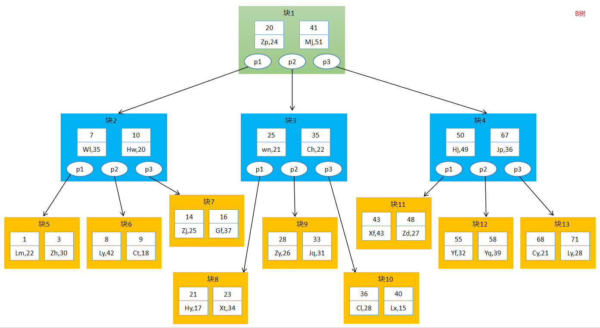
>
>因此需要在B树的基础上，继续进行优化。
>
### B+树
>B+树是对B树的进一步优化，B+树与B数的差异主要有以下几点：
>
>- 叶子节点才会存放实际数据（索引+节点），非叶子节点只会存放索引。
>- 所有索引都会出现在叶子节点，叶子节点之间构成一个有序链表。
>- 非叶子节点中有多少个子节点，就有多少个索引（元素）。
>- 非叶子节点中的索引也会同时出现在叶子节点中，并且是子节点中所有索引的最大（小）值。
>
>以下是一颗B+树的示例：
>
>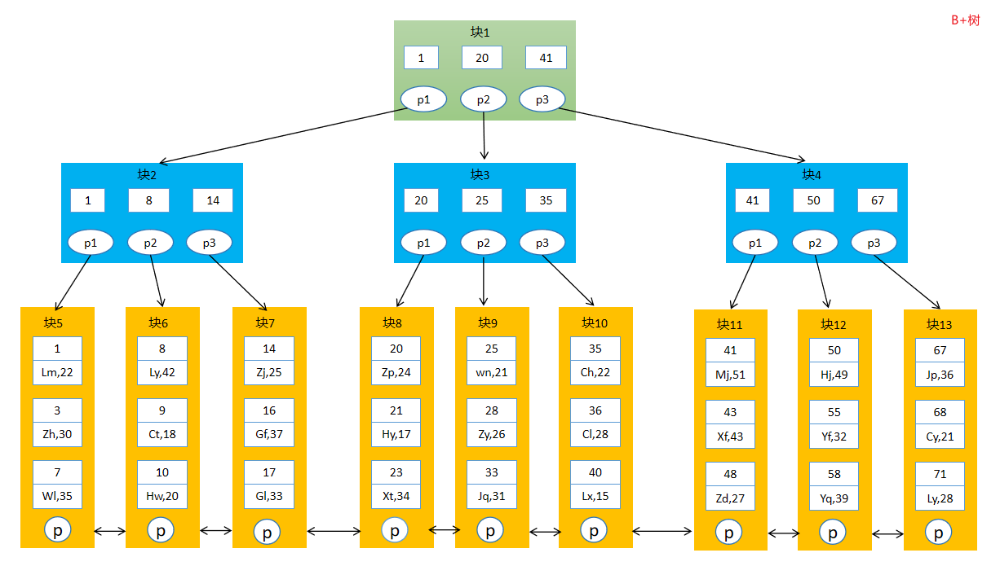
>
>
>
>**为什么说B+树比B树更适合作为数据库索引呢？**
>
>1. B+树的磁盘IO代价更低：B+树的非叶子节点并没有存储记录，只有索引，一个磁盘块中能存放更多的索引，在数据量相同的情况下，B+树比B树更“矮胖”，相对IO读写次数就降低了。
>2. 更适合范围查找：实际使用数据库时，范围查找的应用场景很多。B+树的叶子节点之间使用双向链表进行连接，当进行范围查找时，只需要遍历链表即可。而B树由于没有双向链表的设计，进行范围查找时，只能进行中序遍历，这会涉及多个节点的磁盘IO操作，因此查询效率不及B+树。 
>
>**关于回表**
>
>

## 慢查询
> ~(Gn!)~
>
> 慢查询日志，顾名思义，就是记录了查询比较慢（执行时间长）的SQL的日志，是指mysql记录所有执行超过long_query_time参数设定的时间阈值的SQL语句的日志。**开启慢查询日志**，可以让MySQL记录下查询超过指定时间的语句，通过定位分析性能的瓶颈，才能更好的优化数据库系统的性能。
>
> 该日志能为SQL语句的优化带来很好的帮助。**默认情况下，慢查询日志是关闭的**，要使用慢查询日志功能，首先要开启慢查询日志功能。如果不是调优需要，一般不建议启动这个参数，因为会带来一定性能上的影响。
>
> **常用命令**
>
> 1. 查看慢查询功能的状态
>
> ```sql
> # 查看long_query_time参数的值
> mysql> show variables like "%long_query%";
> +-----------------+-----------+
> | Variable_name   |  Value    |
> +-----------------+-----------+
> | long_query_time | 10.000000 |
> +-----------------+-----------+
> 
> mysql> show variables like "%slow%";
> +-----------------------------+------------------------------------+
> | Variable_name               | Value                              |
> +-----------------------------+------------------------------------+
> | log_slow_admin_statements   | OFF                                |
> | log_slow_extra              | OFF                                |
> | log_slow_replica_statements | OFF                                |
> | log_slow_slave_statements   | OFF                                |
> | slow_launch_time            | 2                                  |
> | slow_query_log              | OFF                                |
> | slow_query_log_file         | /var/lib/mysql/ubuntu2204-slow.log |
> +-----------------------------+------------------------------------+
> 7 rows in set (0.00 sec)
> ```
> 2. 开启慢查询的功能
>
> ```sql
> mysql> set global slow_query_log=ON;  # 只是临时生效，如果要永久生效，必须修改配置文件
> mysql> set global long_query_time=1;  # 修改慢查询的时间为1s，即当SQL语句执行时间超过1s，进行记录
> 									  # 为什么修改之后看不到变化？ 需要重新登录一次
> mysql> show variables like "%slow%";
> +-----------------------------+------------------------------------+
> | Variable_name               | Value                              |
> +-----------------------------+------------------------------------+
> | log_slow_admin_statements   | OFF                                |
> | log_slow_extra              | OFF                                |
> | log_slow_replica_statements | OFF                                |
> | log_slow_slave_statements   | OFF                                |
> | slow_launch_time            | 2                                  |
> | slow_query_log              | ON                                 |
> | slow_query_log_file         | /var/lib/mysql/ubuntu2204-slow.log |
> +-----------------------------+------------------------------------+
> ```
> 3. 查看慢查询SQL记录数
> ```mysql
> mysql> show global status like "%slow_queries";  #
> +---------------------+-------+
> | Variable_name       | Value |
> +---------------------+-------+
> | Slow_launch_threads | 0     |
> | Slow_queries        | 3     |
> +---------------------+-------+
> 2 rows in set (0.00 sec)
> 
> ```
> 4. 执行一条查询时间超过1s的SQL语句
> ```mysql
> mysql> select * from user where email="122222222@qq.com";
> Empty set (3.01 sec)
> ```
> 5. 在慢查询日志中查看具体详情
> ```shell
> # cd /var/lib/mysql
> # vim ubuntu2204-slow.log
> ```
>
> 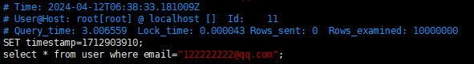
>
> 以上操作展示了如何使用慢查询的功能。
>
> 在实际生产环境中，如果慢查询功能是开启的，那么我们就可以根据慢查询日志，来获取执行时间较长的SQL语句，从而再对其进行有针对性的分析，来优化SQL语句的执行效率。那该如何对SQL语句进行分析呢？就需要了解接下来的知识点：执行计划了。

## 执行计划explain

> ~(Gn!)~
>
> 在实际优化时，我们还可以分析一个查询语句的效率。分析过程中使用的主要工具就是explain语句了。该语句显示优化器将使用的查询计划。
>
> **explain语句的用法**
>
> ```mysql
> mysql> explain <query>;
> ```
>
> 我们只需要在待查询语句前面加上explain关键字，就可以了。如下示例：
>
> 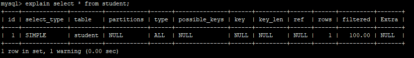
>
> 该表中列出了12个explain输出的字段，我们接下来一一稍作了解。
>
> - <span style=color:yellow;background:red>**id**</span>: 数字标识符，显示表和子查询属于查询的哪个部分。顶级表的id=1，第一个子查询的id=2，以此类推。
> - <span style=color:yellow;background:red>**select_type**</span>:这表示了该表将如何包含在整体语句中。分为simple,primary,union,subquery,derived
> - table:表或子查询的名称。如果已指定别名，则使用该别名。
> - partitions:查询时匹配到的分区信息，对于非分区表值为NULL。
> - <span style=color:yellow;background:red>**type**</span>:表示如何访问数据，又叫访问类型或者连接类型。有ALL/index/range/ref/eq_ref/const/system/NULL
> - possible_keys:此次查询中可能选用的索引。
> - key:此次查询中确切使用到的索引。
> - key_len:使用索引的长度（以字节为单位）
> - ref:与索引比较的字段。
> - rows:大概要检索的行数。
> - filtered:某个表经过搜索条件过滤后剩余记录条数的百分比
> - Extra:额外信息，如using index/filesort/temporary等.
>
### 执行计划字段id
> id表示查询中select子句或操作表的顺序，请看一下示例。
>
> **示例一**
>
> id相同时，执行顺序从上到下进行
>
> ```sql
> explain
> select t2.* from t1, t2, t3
> where t1.id = t2.id and t1.id = t3.id and t1.other_column='';
> ```
>
> 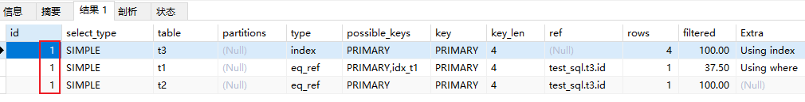
>
> 
>
> **示例二**
>
> id不同时，其值越大，优先级越高，越先被执行
>
> ```sql
> explain
> select t2.* from t2 where id =
> 	(select id from t1 where id = 
> 		(select t3.id from t3  where t3.other_column = ''));
> ```
>
> 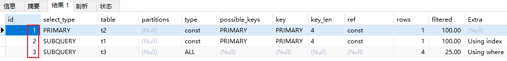
>
> 
>
> **示例三(注意优化器开关)**
>
> 当id值同时有相同和不同的时，依然遵循以上两个策略。
>
> ```sql
> # 关闭MySQL的优化器选项，默认时两个都是打开的
> set optimizer_switch="derived_merge=off,derived_condition_pushdown=on";
> # 再执行
> explain
> select t2.* 
> from (select t3.id from t3 where t3.other_column='') s1, t2
> where s1.id = t2.id;
> ```
>
> 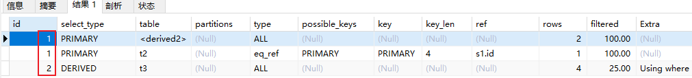
>
> ==**注意**==：关于MySQL对derived table的优化处理与使用限制，可以参考以下文档。
>
> https://cloud.tencent.com/developer/article/2311978


### 执行计划字段select_type
>select_type表示select的查询类型，主要用于区分各种复杂的查询，例如普通查询、联合查询、子查询等。其值有以下几个：
>
>- SIMPLE:表示最简单的select查询语句，在查询中不包含子查询或交并差集等操作。
>- PRIMARY: 查询中若包含复杂的子查询时，最外层的select被标记为PRIMARY。
>- SUBQUERY: 在select或where子句中包含的子查询被标记为SUBQUERY。
>- DERIVED: 在FROM子句中包含的子查询被标记为DERIVED(衍生)，MySQL会递归执行这些子查询，把结果放在临时表中。
>- UNION:若第二个select出现在UNION之后，则被标记为UNION；若UNION包含在FROM子句的子查询中,外层SELECT将被标记为DERIVED。
>- UNION RESULT: 从UNION表获取结果的SELECT。
>
>
>
>**示例一：SIIMPLE**
>
>```sql
>explain
>select * from t1;
>```
>
>
>
>
>
>**示例二：PRIMARY和SUBQUERY**
>
>```sql
>explain
>select (select id from t1 where id < 2)
>from t2;
>```
>
>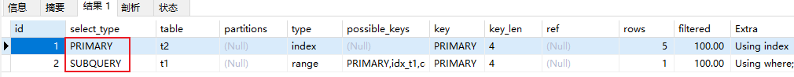
>
>
>
>**示例三：DERIVED**
>
>```sql
>EXPLAIN
>select * 
>from (select * from t1 where id = 1 limit 1) tem;
>```
>
>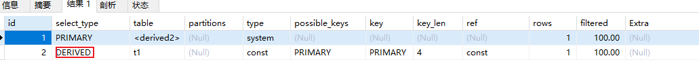
>
>
>
>**示例四：UNION和UNION RESULT**
>
>```sql
>explain
>select * from t1 as a
>UNION
>select * from t2 as b;
>```
>
>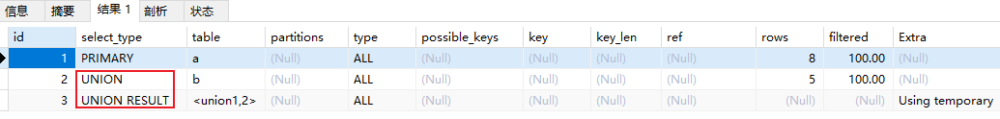
>
>
### 执行计划字段type(重要)
>type显示的是访问类型，它在SQL优化时是非常重要的一个指标。其取值有好多，性能**从好到差**的顺序依次是：
>
>system > const > eq_ref > ref > fulltext > ref_or_null > index_merge > unique_subquery > index_subquery > range > index > ALL 
>
>其中需要我们记忆的是以下几个：
>
>system > const > eq_ref > ref > range > index > ALL
>
>- system: 当表仅有一行记录时（系统表），数据量很少，往往不需要进行磁盘IO。
>- const: 常量连接，单表操作时，查询使用了主键或者唯一索引。
>- eq_ref: 多表关联查询时，主键索引和唯一索引作为关联条件进行等值扫描。
>- ref: 多表关联查询时，非主键索引非唯一索引的等值扫描。
>- range: 范围扫描，使用了in,or,between and, '>','<'等。
>- index: 索引树扫描
>- ALL: 全表扫描，查询没有用到索引，性能最差。
>
>请看以下示例。
>
>**system示例**
>
>表只有一行记录（等于系统表），这是const类型的特列，平时不会出现，这个也可以忽略不计。
>
>```sql
>explain
>select * 
>from (select * from t1 where id = 1 limit 1) tem;
>```
>
>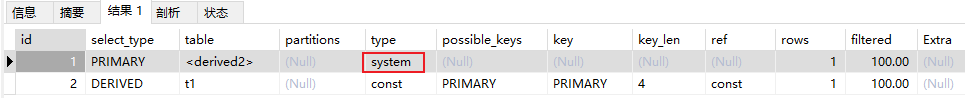
>
>
>
>**const示例**
>
>const用于比较primary key或者unique索引。因为只匹配一行数据，所以很快，如将主键置于where列表中，MySQL就能将该查询转换为一个常量。
>const 扫描的条件为：
>
>- 命中主键（primary key）或者唯一（unique）索引
>- 被连接的部分是一个常量（const）值
>
>```sql
>explain
>select id from t1 where id = 1;
>```
>
>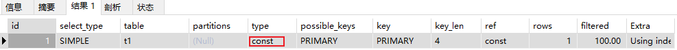
>
>
>
>**eq_ref示例**
>
>eq_ref 扫描的条件为，对于前表的每一行（row），后表只有一行被扫描。
>再细化一点：  
>
>- join 查询
>- 命中主键（primary key）或者非空唯一（unique not null）索引
>- 等值连接；
> 如下图，id 是主键，该 join 查询为 eq_ref 扫描
>
>```sql
>explain
>select * from t1, t2 WHERE t1.id = t2.id;
>```
>
>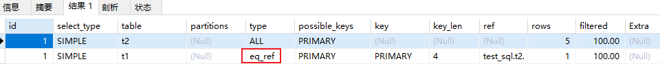
>
>
>
>**ref示例**
>
>如果把上例 eq_ref 案例中的主键索引，改为普通非唯一（non unique）索引。就由 eq_ref 降级为了 ref，此时对于前表的每一行（row），后表可能有多于一行的数据被扫描。
>
>ref 扫描，可能出现在 join 里，也可能出现在单表普通索引里，每一次匹配可能有多行数据返回，虽然它比 eq_ref 要慢，但它仍然是一个很快的 join 类型。
>
>```sql
>explain
>select * from t1,t2 WHERE t1.other_column = t2.other_column;
>```
>
>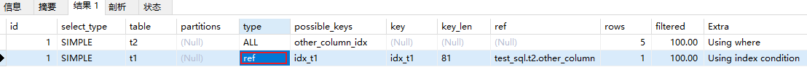
>
>
>
>**range示例**
>
>range就比较简单了。
>
>```sql
>explain
>select * from t1 where id > 2;
>
>explain
>select * from t1 where id in(1, 2, 3, 4, 5);
>
>explain
>select * from t1 where id between 2 and 5;
>```
>
>
>
>
>
>**index示例**
>
>查询需要通过扫描**索引上的全部数据**来计数，它仅比全表扫描快一点。
>
>切记是扫描**整个索引文件**，只是不去扫描真实的数据文件。
>
>```sql
>explain
>select id from t1;
>```
>
>
>
>
>
>**ALL示例**
>
>如果查询时设定的查询条件列上没有建立索引，就是用全表扫描的方式。
>
>```sql
>show index from t1;
>```
>
>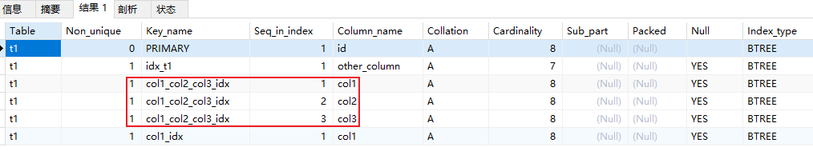
>
>从上面的结果中，我们看到列col2并没有建立索引，因此我们执行以下语句：
>
>```sql
>explain
>select * from t1 where col2 = 'aaa';
>```
>
>
>
>这就是全表扫描了。
>
### 执行计划字段key_len
> key_len表示索引中使用的字节数，可通过该列计算查询中使用的索引的长度。在不损失精确性的情况下，长度越短越好。
>
> key_len显示的值为索引字段的最大可能长度，**并非实际使用长度**，即key_len是根据**表定义**计算而得，不是通过表内检索出的。根据这个值，就可以判断索引使用情况，特别是在组合索引的时候，判断所有的索引字段是否都被查询用到。
>
> 关于key_len的值与索引列本身的数据类型有关，其中比较难以处理的就是字符串类型。接下来，我们先看看字符串类型的相关知识点。
>
> 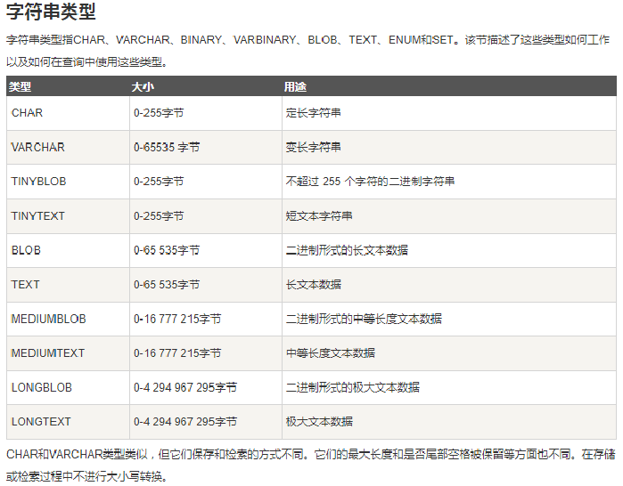
>
> 计算key_len的值，需要注意以下几点：
>
> - 字符串类型中常用的有**char**和**varchar**类型，char类型是固定长度的，而varchar是不固定的长度，因此需要额外2个字节来存储当前字符串的长度。
> - 而且也与字符编码有很密切的联系，因为不同编码的每一个字符占用的空间是不同的，比如latin1占用1个字节，GBK占用2个字节，utf8占用三个字节，utf8mb4占用4个字节。
> - 当字段允许为NULL时，需要额外一个字节记录。
>
> 因此一个字符串的**key_len**的计算公式为：
>
> >  key_len = M * N  + 是否为varchar * 2 + 是否允许为NULL * 1 
> >
> >  其中M为每个字符占用的字节数，N为字符宽度
>
> **示例**
>
> ```sql
> CREATE TABLE char_type (
> 	c1 char(20) CHARACTER SET latin1 NOT NULL,
> 	c2 char(20) CHARACTER SET latin1 DEFAULT NULL,
> 	c3 char(20) CHARACTER SET utf8 NOT NULL,
> 	c4 varchar(20)  CHARACTER SET latin1 NOT NULL,
> 	c5 varchar(20)  CHARACTER SET latin1 DEFAULT NULL,
> 	c6 varchar(20) DEFAULT NULL,
> 	KEY `c1_idx`(`c1`),
> 	KEY `c2_idx`(`c2`),
> 	KEY `c3_idx`(`c3`),
> 	KEY `c4_idx`(`c4`),
> 	KEY `c5_idx`(`c5`),
> 	KEY `c6_idx`(`c6`)
> )ENGINE=INNODB DEFAULT CHARSET=utf8mb4;
> 
> explain
> select * from char_type where c1 = 'a';
> 
> explain
> select * from char_type where c2 = 'a';
> 
> explain
> select * from char_type where c3 = 'a';
> 
> explain
> select * from char_type where c4 = 'a';
> 
> explain
> select * from char_type where c5 = 'a';
> 
> explain
> select * from char_type where c6 = 'a';
> ```
>
> 
>
> 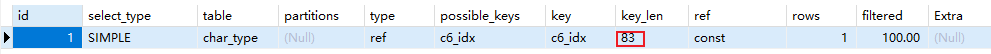
>
> 
>
> **判断是否使用了组合索引**
>
> 第一步先建表
>
> ```sql
> CREATE TABLE `student` (
> 	`id` int NOT NULL AUTO_INCREMENT,
> 	`name` char(30) DEFAULT NULL,
> 	`age` tinyint DEFAULT NULL,
> 	`c1` VARCHAR(20) DEFAULT NULL,
> 	`c2` VARCHAR(20) DEFAULT NULL,
> 	`c3` VARCHAR(20) DEFAULT NULL,
> 	`d_time` DATETIME NOT NULL DEFAULT CURRENT_TIMESTAMP ON UPDATE CURRENT_TIMESTAMP,
> 	PRIMARY KEY(`id`),
> 	KEY `c1_c2_c3_idx` (`c1`, `c2`, `c3`),
> 	KEY `date_idx`(`d_time`)
> );
> ```
>
> 第二步进行测试
>
> **示例一**
>
> ```sql
> explain 
> select * from student where c1='a' and c2 = 'b';
> ```
>
> 
>
> 从结果来看，复合最左前缀，使用**c1,c2两列**作为查询条件。
>
> **示例二**
>
> ```sql
> explain 
> select * from student where c3='a' and c1 = 'b';
> ```
>
> 
>
> 从结果来看，c3不符合最左前缀，所以实际只使用了**c1作为索引**。
>
### 执行计划字段ref
>当使用索引列等值匹配的条件去执行查询时，也就是在访问类型是 const、eq_ref、ref、ref_or_null、unique_subquery、index_subquery 其中之一时，ref 列展示的就是与索引列做等值匹配的对象是啥。如果不是等值查询，则显示为 NULL。
>
>**示例一**
>
>```sql
>explain
>select * from t1, t2 WHERE t1.id = t2.id;
>```
>
>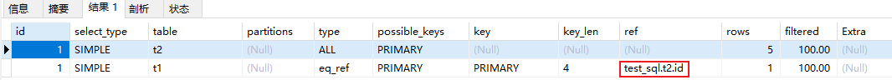
>
>**示例二**
>
>```sql
>explain 
>select * from t1 where col1='aa';
>```
>
>
>
### 执行计划字段Extra
>Extra是执行计划输出中另外一个很重要的字段，该列显示了MySQL在查询过程中的一些详细信息。常见的值有以下几个：
>
>- **Using filesort**: 表示MySQL会对数据使用一个**外部排序**，而不是按照表内的索引顺序进行读取，因此称为文件排序 。
>- **Using temporary**: 使用了临时表保存中间结果，如子查询的结果、排序或者分组。
>- **Using index**: 使用了覆盖索引。
>- Using Where:使用了where过滤，但并没有使用索引。
>- Impossible where: where子句的值总是false, 不能用来获取任何元组。
>- Using join buffer:使用了连接缓存。
>
>**示例一**
>
>```sql
>explain
>select c1,c2 from student order by c1; 
>```
>
>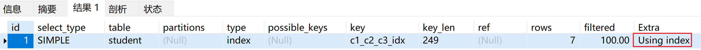
>
>**示例二**
>
>```sql
>explain
>select c1,c2 from student order by c2; 
>```
>
>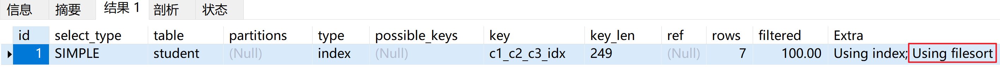
>
>**示例三**
>
>```sql
>explain
>select c2, avg(age) from student group by c2;
>```
>
>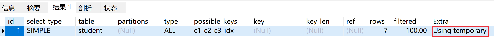
>
>


## SQL优化策略（重要）
> ~(Gn!)~
>
> 当我们了解了索引和执行计划之后，就相当于拿到了SQL语句的诊断工具了，可以用他们来分析SQL语句的效率。
>
> 索引最大的好处是提高查询速度，但索引也是有缺点的，比如：
>
> 1. 需要占用物理空间，数量越大，占用空间越大。
> 2. 创建索引和维护索引要耗费时间，且会随着数据量的增大而增大。
> 3. 会降低表的增删改的效率。因为每次增删改索引，B+树为了维护索引的有序性，都会进行动态维护。
>
> 所以，索引并不是万能钥匙，需要根据场景来进行选择。
>
> **何时该创建索引？**
>
> 1. 字段有唯一性限制的，比如学生编号。
> 2. 经常用于Where子句的字段，如果查询条件不是一个字段，可以建立联合索引。
> 3. 经常用于Group By和Order By的字段，这样查询的时候就不需要再去做一次排序了。因为建立好索引之后，在B+树中的记录都是排序好的。
>
> **何时不该创建索引？**
>
> 1. Where子句、Group By和Order By中用不到的字段，就不需要建立索引。
> 2. 字段中存在大量重复的数据，不需要创建索引。比如性别字段，只有男和女。
> 3. 表数据太少的时候，不需要创建索引。
> 4. 经常更新的字段不该创建索引，比如用户余额，就不需要创建索引。如果创建索引，为了维护B+树的有序性，就需要频繁的重建索引，这样对数据库性能会造成影响。
>
> **防止索引失效**
>
> 创建了索引之后，并不意味着查询的时候一定会使用索引，因此我们要清楚哪些情况会导致索引失效，从而避免写出索引失效的查询语句，否则这样的查询效率是很低的。以下是一些索引失效的情况：
>
> - 在查询条件中，对索引列上进行运算。
> - 使用模糊匹配时，比如`like %xx` 或者`like %xx%`都会造成索引失效。
> - 联合索引要正确使用必须遵循最左匹配原则，否则也会导致索引失效。
>
> **常用实践策略**
>
> 1. 尽量使用覆盖索引，防止回表，比如尽量不要使用select *
> 2. 尽量使用最左匹配原则
> 3. 不要在索引上做运算
> 4. 范围查找尽量不要太大
> 5. 尽量不要使用不等于
>
> **SQL使用规范**
>
> 1. 尽量使用InnoDB存储引擎：支持事务、行级锁、并发性能好、CPU及内存缓存页优化使得资源利用率更高。
> 2. 禁止存储大文件或者大照片：为何要让数据库做它不擅长的事儿？大文件和照片存储在文件系统，数据库中存储URI更好。
> 3. 控制单表数据量，单表记录控制在千万级。
> 4. 平衡范式与冗余，为提高效率可以牺牲范式设计，冗余数据。
> 5. 表必须要有主键，例如自增主键，推荐使用UNSIGNED整数为主键，有两个好处：
>
>    1. 主键递增，数据行写入可以提高插入性能，可以避免Page分裂，减少表碎片，提升空间和内存的使用
>    2. 主键要选较短的数据类型，InnoDB引擎的普通索引都会保存主键的值，较短的数据类型可以有效减少索引的磁盘空间，提高索引的缓存效率。
>
> 6. 禁止使用TEXT、BLOB类型：会浪费更多的磁盘和内存空间，非必要的大量的大字段查询会淘汰掉热数据，导致内存命中率急剧下降，影响数据库性能。
>
> 7. 根据业务区分使用char/varchar:
>    1. 字段长度固定，后者长度近似的业务场景，适合使用char，能够减少碎片，查询性能高。
>    2. 字段长度相差较大，或者更新较少的业务场景，适合使用varchar，能够减少占用空间。
>
> 8. 必须把字段定义为`NOT NULL`并且提供默认值。
>    1. NULL的列使索引、索引统计、值比较都更加复杂，对MySQL来说更难优化。
>
>    2. NULL这种类型MySQL内部需要进行特殊处理，增加数据库处理记录的复杂性。
>
>    3. 同等条件下，表中有较多空字段的时候，数据库的处理性能会降低很多。
>
>    4. NULL值需要更多的存储空间，无论是表还是索引中，每行中的NULL列都需要额外的空间来标识。
>
>    5. 对NULL进行处理时，只能采用is NULL或is NOT NULL，而不能采用 = 、!=、<>、in、not in、<这些操作符号。如：where name != '张三'，如果存在name为NULL的记录，查询结果中就不会包含name为NULL的记录。
>
> 9. 单表索引建议控制在5个以内。
>    1. 互联网高并发业务，太多索引会影响写性能。
>
>    2. 生成执行计划时，如果索引太多，会降低性能，并可能导致MySQL选择不到最优索引。
>
> 10. 禁止在更新十分频繁、区分度不高的列上建立索引。
>
> 11. 建立组合索引，必须把区分度高的字段放在前面：能够更加有效的过滤数据。
>


## MySQL的锁机制
> ~(Gn!)~
>
>在数据库中，**并发控制**是指在多个用户/进程/线程同时对数据库进行操作时，保证**事务**的**一致性**和**隔离性**，同时最大程度地并发。并发控制的目的是保证一个用户的工作不会对另一个用户的工作产生不合理的影响。在某些情况下，这些措施保证了当用户和其他用户一起操作时，所得的结果和用户单独操作时的结果是一样的。
>
>**事务**是并发控制的基本单位，并发控制机制的任务是：
>
>> 1. 对并发操作进行正确调度。
>> 2. 保证事务的隔离性。
>> 3. 保证数据库的一致性。
>
>并发控制的技术不止一种，其中最重要的莫过于**锁机制**了。接下来，我们研究一下MySQL中的锁机制。
>
>**锁**是计算机协调多个进程或线程并发访问某一个资源的机制。在数据库中，除传统的计算资源（CPU、RAM、I/O）的争用以外，数据也是一种供许多用户共享的资源。如何保证数据并发访问的一致性、有效性是所在有数据库必须解决的一个问题，锁冲突也是影响数据库并发访问性能的一个重要因素。从这个角度来说，锁对数据库而言显得尤其重要，也更加复杂。
>
>**锁的分类**
>
>1. 按锁的粒度划分
>
>- 表锁：MySQL数据库下的MyISAM和InnoDB存储引擎都支持表锁，锁住一张表。
>- 行锁：MySQL数据库下的InnoDB存储引擎支持行锁，锁住某一行。
>
>2. 按锁的功能（操作）划分
>
>- 共享锁（读锁）：又称为S锁，事务T对某一数据加读锁后，其他事务只可以读这条数据，但不能修改。
>- 排他锁（写锁）：又称为X锁，事务T对某一数据加写锁后，只有事务T可以操作该数据，其他事务既不能读更不能写。
>
>3. 按范围划分
>
>- 间隙锁（Gap Lock）：锁定一个范围，但不包括现有的值，用于防止其他事务在范围内插入新行。间隙锁常用于防止幻读。
>- 临键锁（Next-key Lock）：是间隙锁和行级锁的组合，对一个范围进行锁定，并锁定范围内的现有行，以防止其他事务插入新行或更新已存在的行。
>
>4. 按使用方式划分
>- 乐观锁（Optimistic Lock）：其特点先进行业务操作，不到万不得已不去拿锁。即“乐观”的认为拿锁多半是会成功的，因此在进行完业务操作需要实际更新数据的最后一步再去拿一下锁就好。
>- 悲观锁（Pessimistic Lock）：其特点是先获取锁，再进行业务操作，即“悲观”的认为获取锁是非常有可能失败的，因此要先确保获取锁成功再进行业务操作。
>
>

# The End